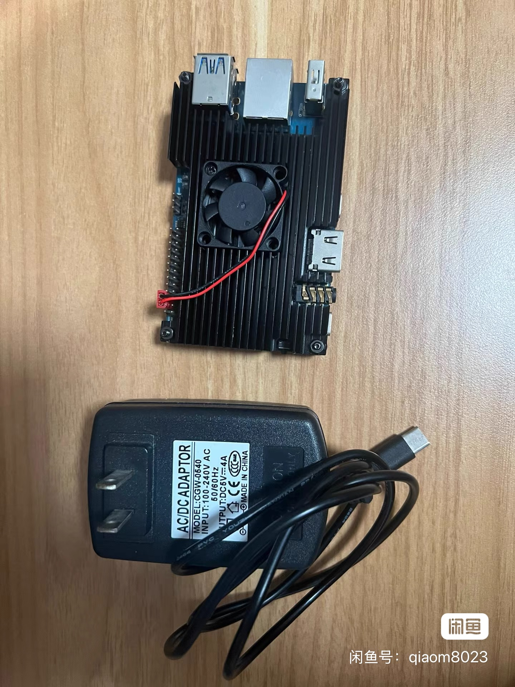
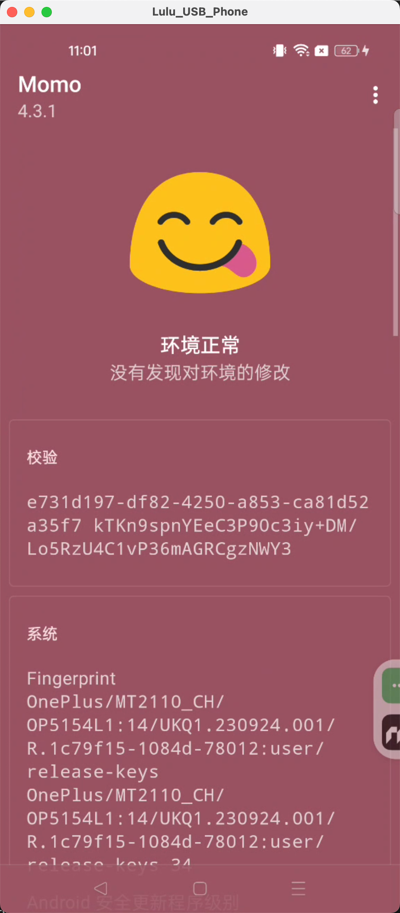
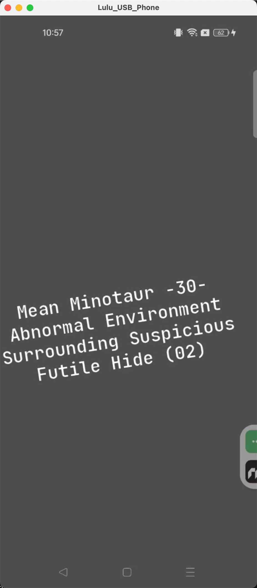
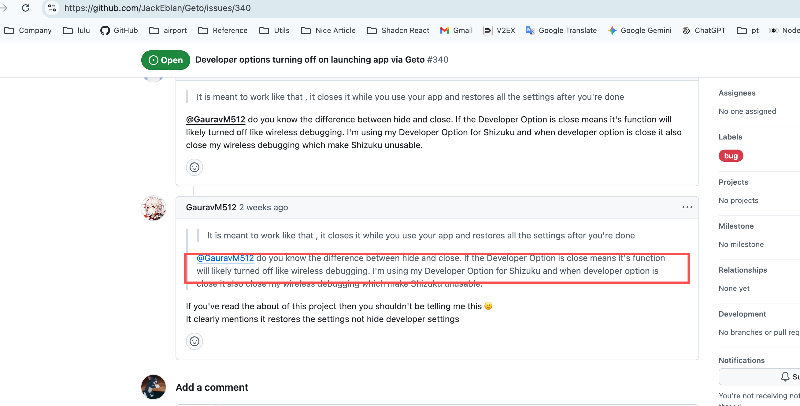
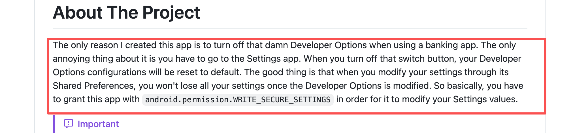
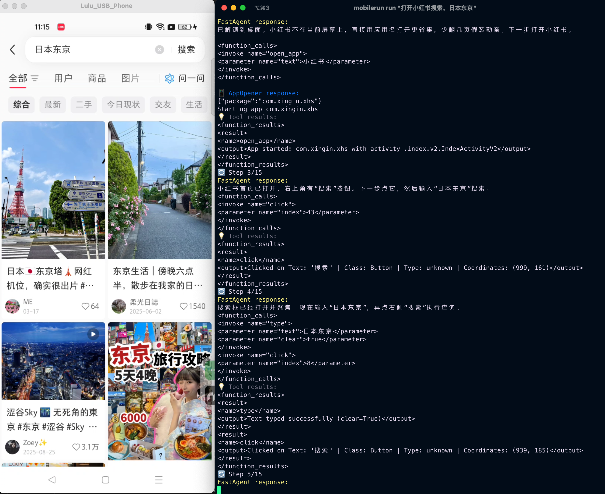

## 背景
在如今AI浪潮下，我第一个反应就是想让AI做点实质性的事情。众所周知，IOS封闭，感觉想捣鼓它很难。我就把目光放到的android，想当年，第一份工作一开始就是写的android。

因为我是苹果全家桶，我想要的是ios能直接通过wg连接到家里的android，也就是”云手机“。或者通过openclaw之类的，远程触发大模型执行app的动作，打开淘宝买东西。上闲鱼自动搜索之类的。当然也要支持脚本调用。

## Redroid
既然是做自动化，那第一个反应就不是真机，而是大量的模拟器。搜了一下，了解到云手机概念。然后得到一个关键词redroid

[redroid](https://github.com/remote-android/redroid-doc)，大部分的云手机都是基于它开发的。基于docker，共享宿主机的资源，跑起来，单个android只需要几百MB，支持GPU加速，无敌了，支持X86.

### x86
我立刻按照官方文档跑起来。我家有个的unraid，因为unraid不像其他机器，内核不好直接修改。经过一翻寻找，在社区论坛有了[答案](https://forums.unraid.net/topic/149453-redroid-on-unraid/)

然而跑起来不尽人意，并且资源占用极高。最重要的是，android上的app基本都是arm架构，常用的app根本找不到apk。

找了一个京东的x86,暴露出3没考虑的问题。
- 架构不对，容易闪退
- 风控检测，wifi检测，定位检测。
- 资源占用高，耗电量大

### arm,香橙派5,rk3855
x86的资源占用以及app闪退的问题，自然要换arm架构。
然后又要满足我”云手机“的方案，搜索一翻得到关键字”香橙派rk3855“,为啥是经v站大佬点播，rk3855芯片好像就是现在云手机的主流。而香橙派5就是搭载这颗芯片，性价比较高的板子。我以前从没玩过，这次正好学一学。
最重要的是有大佬做了针对rk3588的[android镜像](https://github.com/CNflysky/redroid-rk3588)，里面处理了虚拟wifi的事情。并且支持了Magisk (Kitsune fork)

这里引出了Magisk，没搞过android在这踩到了坑。

闲鱼启动！速速拿下16g的香橙派5,如今这时代，内存都涨上天了，真贵啊。

没玩过板子的我，插上去跑起来后，看下下待机功耗。2w，我的天啊，那我unraid的x86,36w算什么。震惊到我了。
卖家提前装好了ubuntu，docker都在，直接pull镜像就跑起来了。一个字”牛畅“。

然后就开始安装各种app，什么微信，京东，支付宝啥的。接下来就是解决远程控制的问题。

## 远程控制android

[Scrcpy](https://github.com/Genymobile/scrcpy),各个平台都适配了，非常好用，我在mac上可以120fps。打游戏看着是没任何问题了。但是好像没有ios的支持。

### ios平台

ios上我搜了下有2个方案，1个是基于web的[ws-scrcpy](https://github.com/NetrisTV/ws-scrcpy)
另一个是ios应用，[scrcpy-remote](https://github.com/wsvn53/scrcpy-mobile)，以前是开源的现在收费22块。当然你可以找共享账号。

但是不论是web还是ios都不支持120fps。

## 风控

沉迷在ios随意链接android的兴奋中，我第一件事就是想自动化微信的一个小程序打卡。然后迫不及待的下载微信，登录我的账号，这里提示要接验证码。没怎么在意。

然而第二天上班的时候，我ios的微信登录时，账号提示被封，需要学习安全知识，并且是首次，如果下次还有直接封禁，太离谱了。这个风控。

后来才知道android默认开了magisk，这里就引出了android捣鼓的精髓，root，隐藏root，lsposed，等一系列坑。

在我问了gpt，gemini等”高端大脑“之后，的出一个结论，redroid想要过风控太难，各种地方都有可能出漏洞，一旦出漏洞就会被封。真的想过这些app，乃至金融app。只能使用真机。😅，天塌了，没办法，我盯着香橙派，实在不知道我能用它干什么，nas我有了。只能给它重新上了海鲜市场。最后在原价+50价格卖出去了，理财产品？

## 真机一加9rt

搜了一圈真机，最后准备买红米，然后听说现在bl解锁很麻烦。就盯上了一加的。最后闲鱼淘了一个9rt。460速速拿下。

### root
到手后，发现机器已经bl，然后就是研究下怎么root了，搜索后，什么magisk，什么阿尔法，什么kernal sku啥，还有杂鱼啥的，太复杂了。

在b站找到了答案。[一加root](https://www.bilibili.com/video/BV1AnCTBNEaE/?vd_source=d3ad372092ca464d919a119a96d0aa8b)也是有大佬做了工具。

速速root了。
### root隐藏

这次我聪明了，知道这些app为啥封号了，没做root隐藏。参考了[b站视频](https://www.bilibili.com/video/BV1yfoZB7EUE/)，感谢这些作者提供的方案。

按照视频的流程，主要就是magisk自己隐藏，以及配合隐藏app，还有bl隐藏和密钥自动获取，这几样就可以了。

最后的成果就是过momo，但是牛头人依然有问题。不过不影响使用了，中国电信，12306都可以过，支付宝也都可以，只不过支付宝、微信支付的时候，因为会检测到usb调试，会显示不安全，但可以支付。

#### 虚拟定位

都root了，肯定要搞一个虚拟定位测试一下，然后就安装lsposed模块。这个就不多说了，网上有各种教程，还要去tg群里找，因为这种开源的话，那root就很容易被检测了。

使用的模块式GhostMapX，这个是开源的，但已经不维护了，而且里面的地图服务无法使用，tg上有人转为这个做了一个hook，修改里面的地图服务，也是一个模块。两个搭配起来即可。

我测试了下，微信、高德、磨叽天气，都没问题。

#### 隐藏开发者模式

我在尝试虚拟定位打卡公司的app的时候，怎么都不过，一直提示设备不安全，抓了下logcat，发现app会检测是否开启了开发者模式。确切说是usb调试。并且支付宝微信哪些也是会检测，但是人家至少给你用啊。不过这个对我后面用llm，去自动化感觉有阻碍。

搜索一番后，得到一个[IAmNotADeveloper](https://github.com/xfqwdsj/IAmNotADeveloper)这个我无脑的直接安装了，结果，微信立马触发风控进行认证，我傻了，咋回事。立马关闭模块，用中国电信试了，果然打不开了。

最后在github的主页人家写的很明白。就是直接代码注入，会被检测的。所以说啊，不要开源的就直接上去用，省的号被封。

后来在IAmNotADeveloper的issus中找到了一个[Geto](https://github.com/JackEblan/Geto)

这个Geto依赖Shizuku，而且不需要root，我很好奇它怎么做到的，然后测试了下，你别说确实可以，支付宝微信都是安全的支付场景了。然而有大问题，我没办法scrcpy了，后来看了下issue，人家写的很清楚了，是为了方便隐藏开发者，在你打开app只是调用了系统去关闭了开发者模式，然后退出app的时候，又给恢复罢了。并不是真的隐藏🥲

### LLM自动化

经过上面的捣鼓，最后隐藏开发者这件事情好像确实没办法了。那就先做其他的吧。

LLM这边我搜了一圈[mobilerun](https://github.com/droidrun/mobilerun)在github最活跃。star也很多。

体验了一下确实没问题，搭配上CPA反代gpt的free账号，一点问题没有。挺好，但有得时候会response卡住，不知道为啥。

但是实际测试下，如果不是gpt5.5的脑子，比如让它打开微信小程序KFC，会有问题，还得要好脑子才行啊。

### 其他
当然android还有一个保命的要ssh。省的开发者模式调了，连不上机器。

还有一直充电鼓包的事情。至于屏幕的话，scrcpy链接的时候打开turnoffscreen参数就可以了。

这些知识，不赘述了。如今只要问问gpt就可以了，想以前，得在网上冲浪几天才行。”食大便了啊“

## 自动化
总的来说，目前还没用自动化做太多事情，比如抢票，或者挂号啥的，这些如果基于llm，还是算了，llm思考的过程，远远比不上人。能做的就是自动化测试，或者打卡这类事情。

不过LLM，去学习页面，然后得出元素坐标的话，生成自动化脚本，然后adb直接走的话，应该是个好思路。这个就后面慢慢研究了。

## 总结
前前后后花了1个多月吧，想到我以前折腾一机两用的场景了，人生的意义就是在于折腾。后续在更新自动化篇吧。

