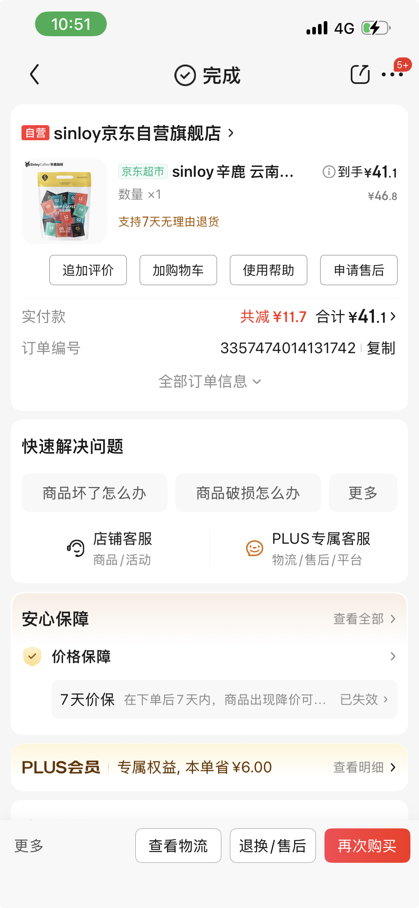
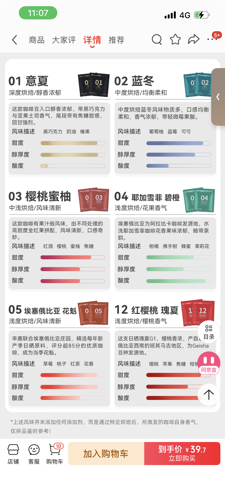
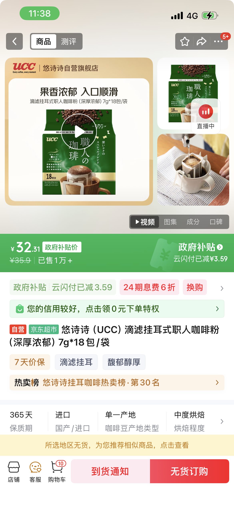
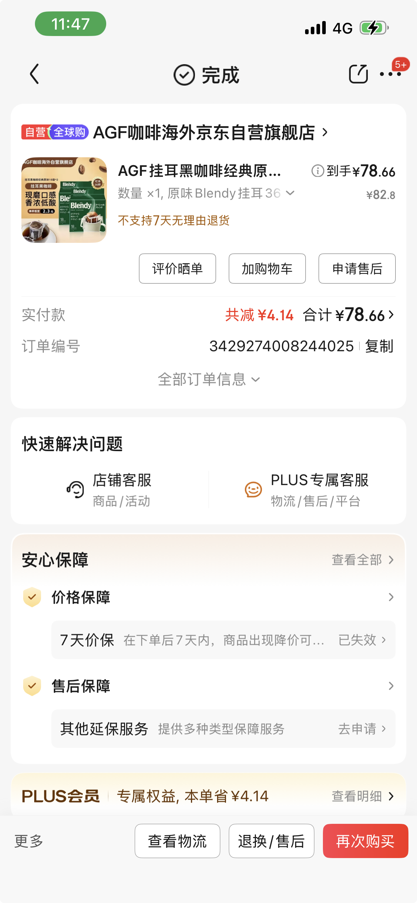
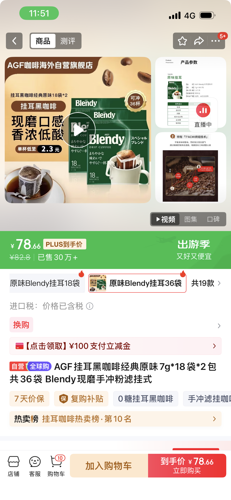
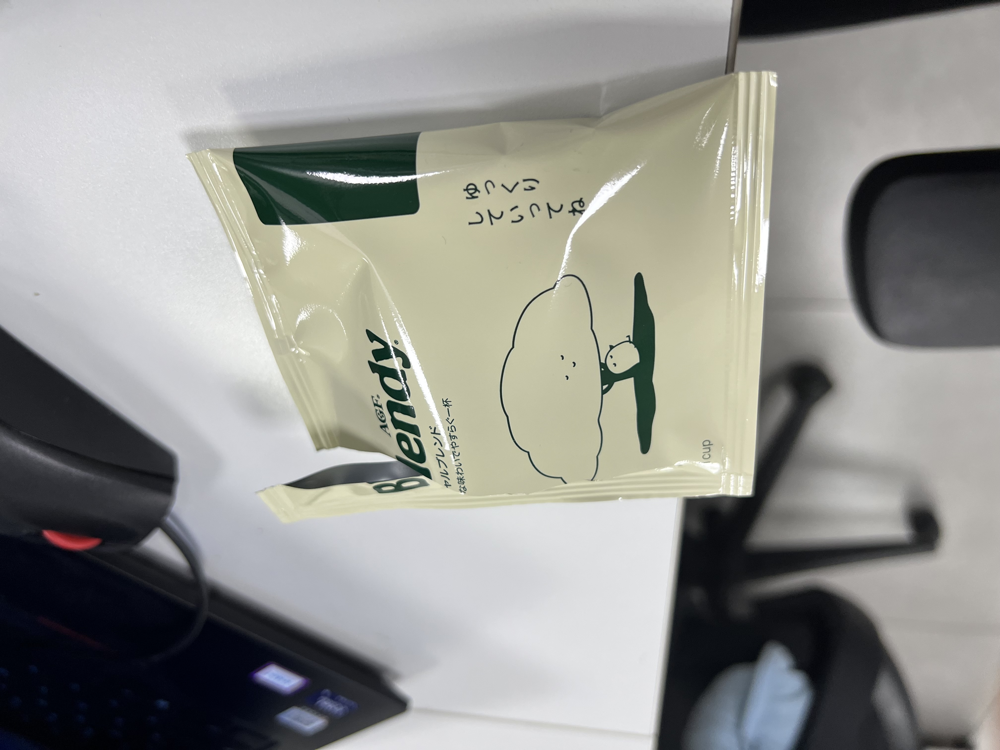
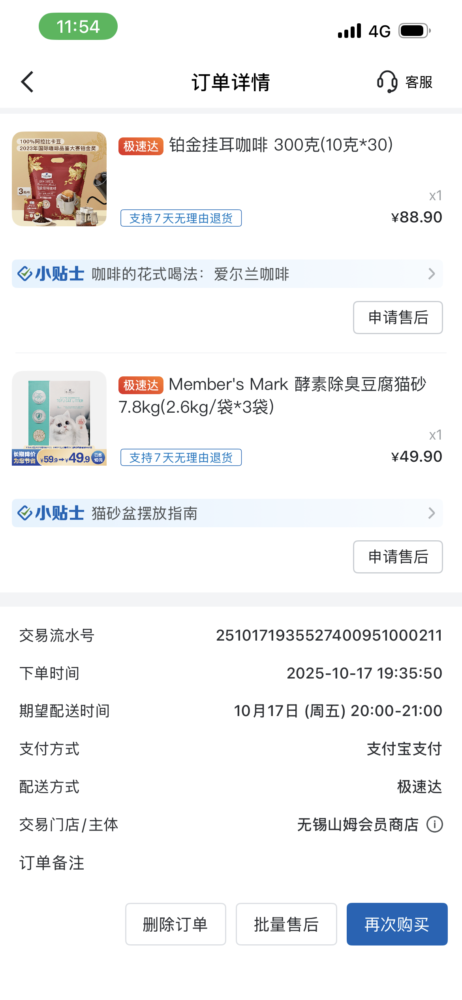
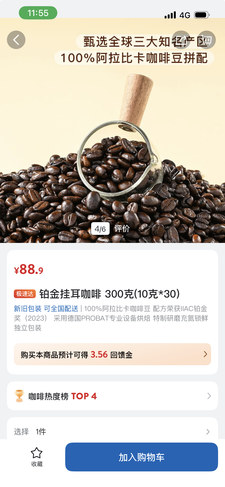

不知道从什么时候开始，我爱上了挂耳咖啡。
以下的评测是按我购买顺序打分的，满分5⭐️

## 辛鹿
入门看大家推荐了辛鹿，先说价格41,20杯，2块一杯，价格确实便宜，里面各种名词。“蓝冬”，“花魁”啥的。不太懂。
喝起来，我自己最喜欢的还是“意夏”，可能是我喜欢可可的愿意吧。

至于网友觉得很好喝的“花魁”啥的，我倒是不喜欢，因为我觉得咖啡还是苦的好喝，“花魁”喝起来不像咖啡了。

最为新人“意夏”我打分⭐️⭐️⭐️⭐️，其余只能给⭐️⭐️

## GCC
GCC,号称霓虹职场贫民，我对霓虹的认可不多说了。必须得尝试一下，价格和辛鹿差不多。但是吧，口味说实话不咋的，咖啡香味不多，苦味很重，酸味也是的。
看来即使是霓虹产品，也是一分钱一分货啊。

打分⭐️⭐️⭐️

## Blendy
Blendy好像是在V占看到人推荐的，霓虹产品，必须试试。
价格来到了78/36,2快多，也不是很贵，品尝起来，我觉得是目前最好喝的。可可味很足，酸味很小。使满足我的口味。瞅瞅这个包装，还有图案，可爱㖏。

打分⭐️⭐️⭐️⭐️

没给满分，是因为我还没喝其他的产品。

## 山姆
山姆的其实我最一开始买的，啥都没看评测，认为山姆质量肯定好，这个价格3.3/杯，也挺贵，肯定好喝。然而拉胯。苦味极重，没有喝出香味。属于“拉”的级别。

打分“0”

