不知道从什么时候开始，我爱上了挂耳咖啡。
以下评测按我的购买顺序打分，满分 5⭐️。

## 评分

| 品牌 | 评分 | 特点 | 参考价格 |
| :--- | :--- | :--- | :--- |
| **辛鹿 (Xinlu)** | ⭐️⭐️ - ⭐️⭐️⭐️⭐️ | 入门首选，款式多，“意夏”可可味足 | ~2 元/杯 |
| **GCC** | ⭐️⭐️⭐️ | 苦味重且带酸，香气一般 | ~2 元/杯 |
| **Blendy** | ⭐️⭐️⭐️⭐️ | 目前最爱，可可味浓郁，酸度极低 | ~2 元/杯 |
| **山姆 (Sam's)** | 0 | 极苦且无香，性价比低，不推荐 | ~3.3 元/杯 |
| **皮爷 (Peets)** | ⭐️⭐️⭐⭐️ | 香，不错，好喝，贵！ | 9 元/杯 |
| **Bob** | ⭐️⭐️⭐️⭐️| 不错，好喝，性价比高 | ~3.2 元/杯 |
| **AOKKA** |⭐️⭐️ | 味道淡，苦味重，香气还可以，性价比一般 | 3.8 元/杯|
| **TerraForm** | ⭐️⭐️⭐️⭐️½ | 味道足，价格合适，性价比极高 | ~2.4 元/杯 |

## 辛鹿
入门时看大家都推荐辛鹿。先说价格，41 元 20 杯，差不多 2 块一杯，确实便宜。里面各种名词，“蓝冬”“花魁”啥的，我也不太懂。
喝起来，我自己最喜欢的还是“意夏”，可能是因为我喜欢可可味吧。

至于网友觉得很好喝的“花魁”啥的，我倒是不太喜欢，因为我觉得咖啡还是苦一点更好喝，“花魁”喝起来都不像咖啡了。

作为入门款，“意夏”我打分 ⭐️⭐️⭐️⭐️，其余只能给 ⭐️⭐️。

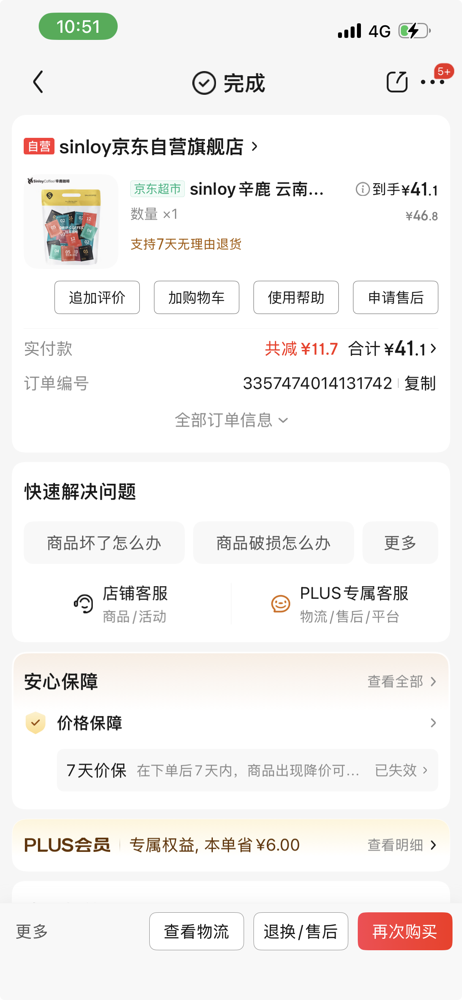
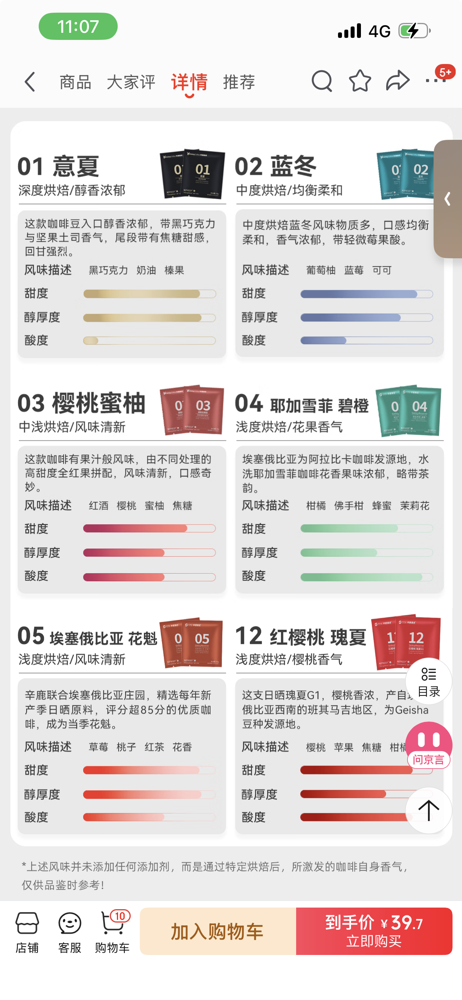

## GCC
GCC，号称霓虹职场贫民咖啡，我对霓虹的认可就不多说了，必须得尝试一下。价格和辛鹿差不多，但是口味说实话不咋地，咖啡香味不多，苦味很重，酸味也有点明显。
看来即使是霓虹产品，也是一分钱一分货啊。

打分⭐️⭐️⭐️

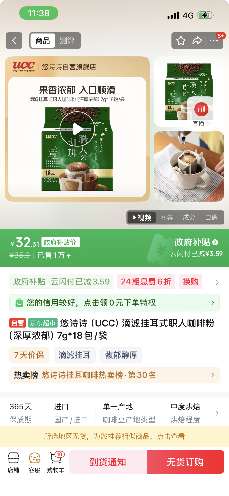

## Blendy
Blendy 好像是在 V 站看到有人推荐的，霓虹产品，必须试试。
价格来到了 78/36，算下来 2 块多，也不是很贵。品尝起来，我觉得这是目前最好喝的，可可味很足，酸味很小，很满足我的口味。再瞅瞅这个包装，还有图案，可爱嘞。

打分⭐️⭐️⭐️⭐️

没给满分，是因为我还没喝更多别的产品。

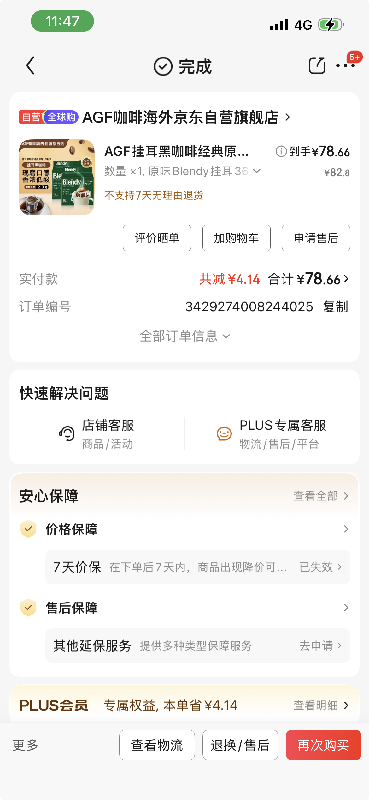
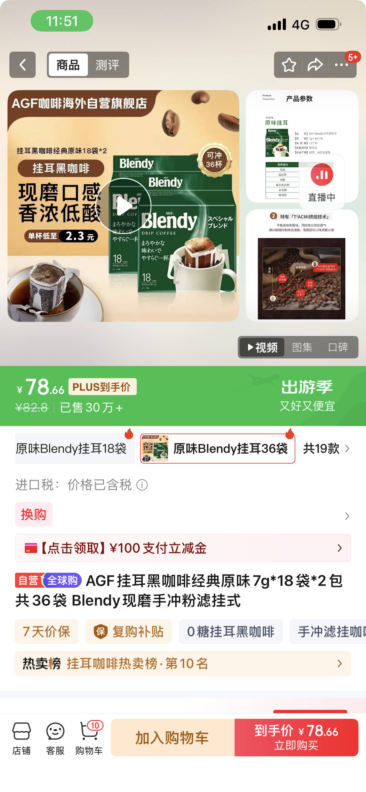

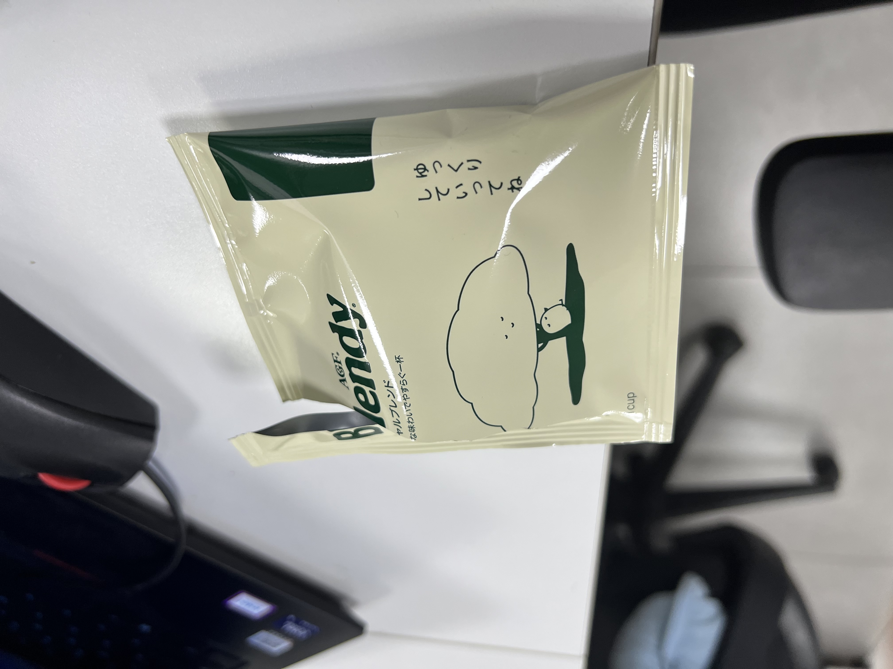

## 山姆
山姆其实是我最开始买的，啥评测都没看，想着山姆质量肯定好。这个价格 3.3 元一杯，也不算便宜，按理说应该挺好喝，然而非常拉胯。苦味极重，也没喝出什么香味，属于“拉”的级别。

打分“0”

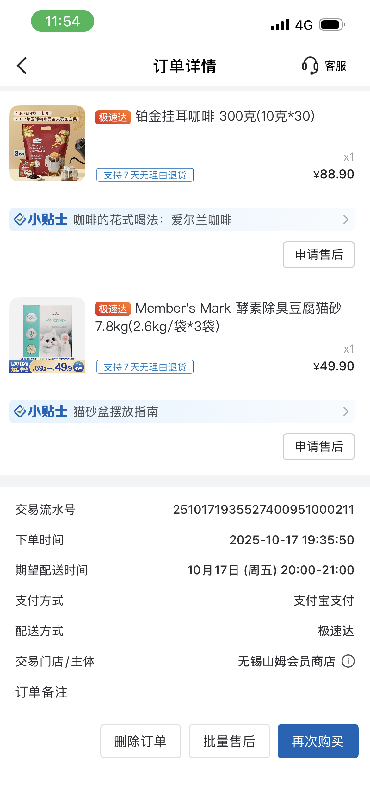
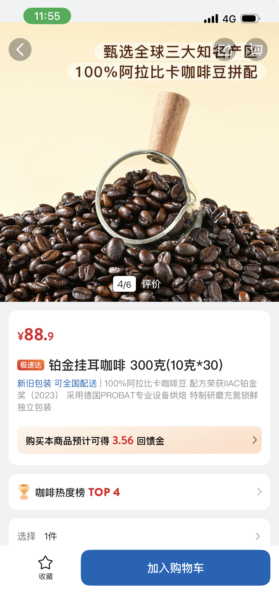

## Peets
我是没想买Peets的，价格给查看错了，45是10g*5,我看成了5g*10.
10块一包实在是太贵了，消费不起。秉持着买都买了，肯定要试一下的，和blendy快5倍价格。
味道确实香，我选的中烘焙。而且有明显的果香，是我喜欢的。
打分⭐️⭐️⭐️⭐️
没满分，是因为我喝不起。

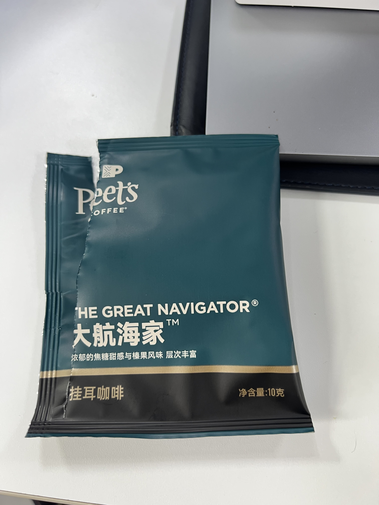
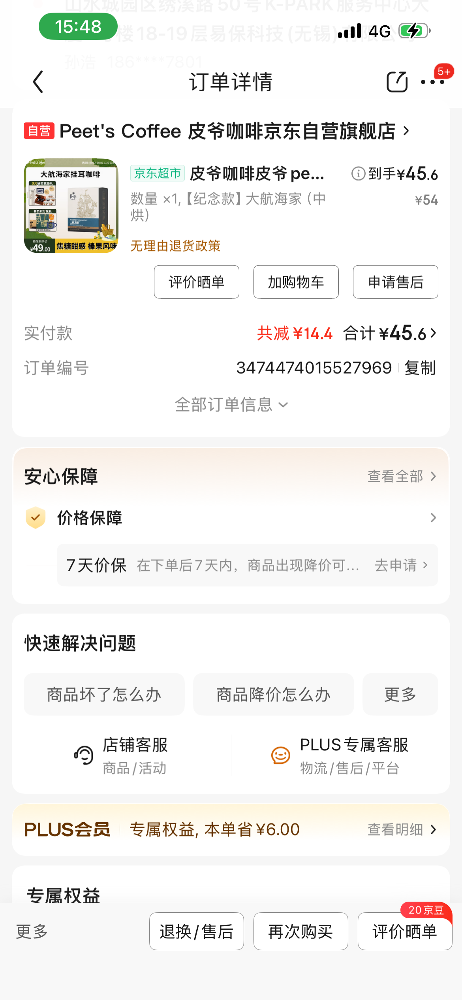

## Bob
这个是在ns站看到别人推，价格67.5，21片，平均3.2元.
你别说，味道可以的，我买的都是中烘，我喜欢那种可可的感觉，酸味基本没有。和Peets比起来，当然差点，但是和其他的blendy, gcc比起来，好上不少。目前属于是人上人了。价格也合适,你要说缺点吧，有些味道喝起来不咋的,说不上来，每个人口味可能不一样。

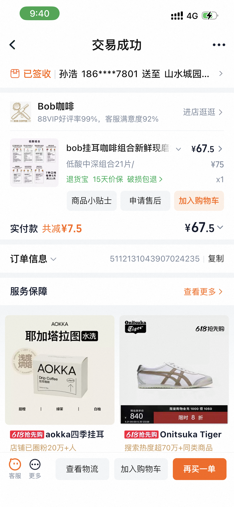
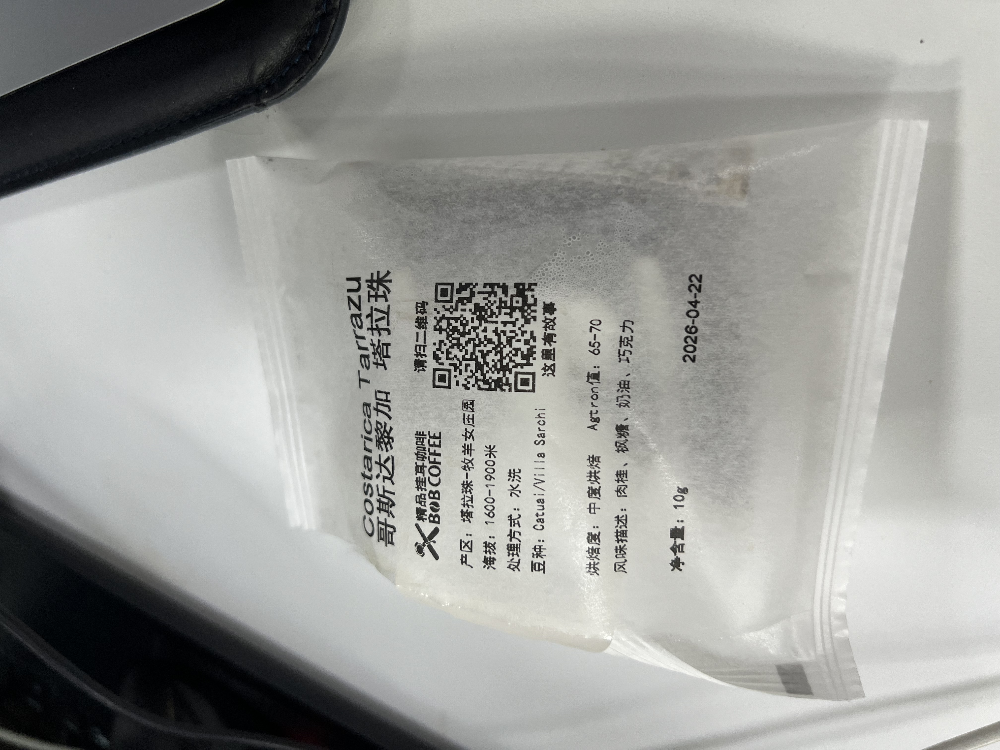

打分⭐️⭐️⭐️⭐️

## AOKKA
也是ns上看到的，37.8,10包，3.8一包，有点贵了感觉。问题是，咖啡味道很淡，水水的感觉，并且滤纸很差劲，一摸就感觉到了，到嘴里只有苦味。不咋的，不推荐。闻起来还行，泡起来是很差，不如blendy。比gcc好点。但是价格太贵了。远不如Bob。

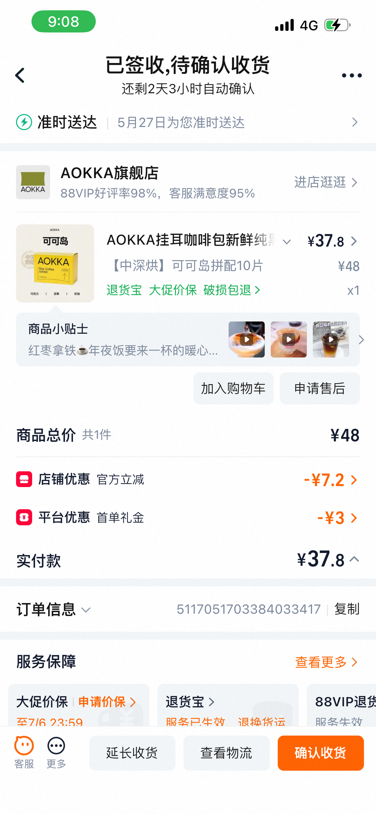
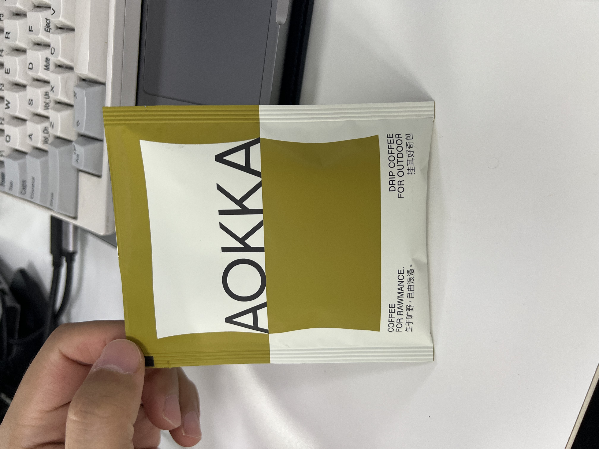

打分⭐️⭐️

## TerraForm

也是在ns上看到的，36.2,15包，一包才2.4, 味道不错的，我选的依然是中烘，味道足，价格合适。也是小企业自己的产品和Bob一样。简直绝了，如果不是后面想知道有没有更好的，我可能要打5分了，给4星半。

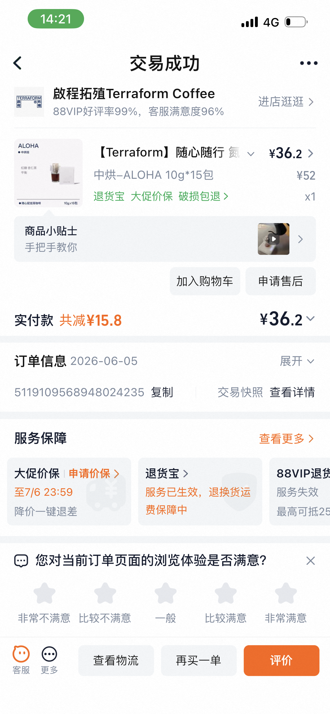
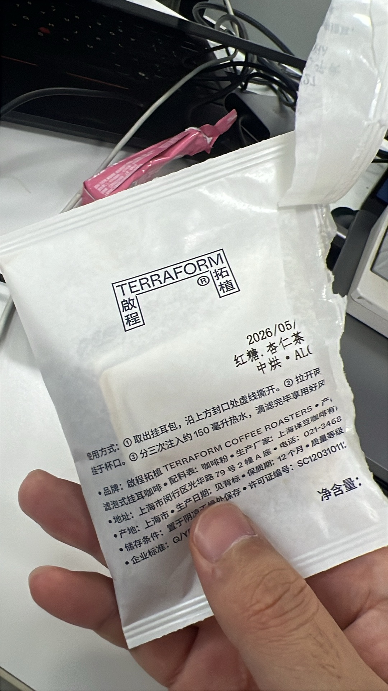

打分⭐️⭐️⭐️⭐️½