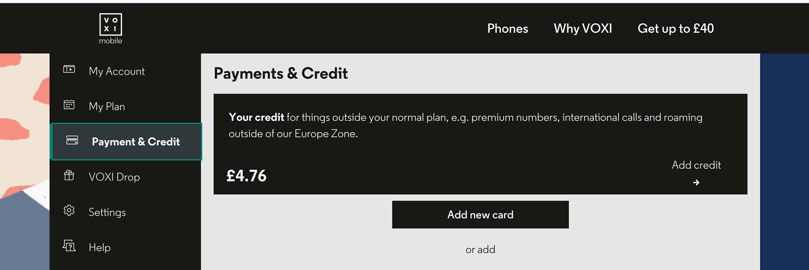

## 背景
Giffgaff,好多年了，号称保号神卡，很多网友注册的网站，甚至银行手机号都是这个。直到GPT来了，讲道理国人用点AI是真不容易，🪜只是入门罢了，还要和封号斗智斗勇。GPT推出了Codex的手机验证，推动了海量用户去注册GG卡，小红书的集美人手一张。据我所知，GG卡在2025的时候就不邮寄中国大陆了，我以为是比少量的卡，然而tg上，有个老板，也许就是因为他导致GG封号。他从香港弄到内陆，几千张卡，25包邮，当时我还转手在闲鱼上卖了几张。

后来就喜闻乐见了，小红书集美都人手一张了，门槛太低，应该是全部都封号了，嘿，余额还不退，我冲了10英镑呢。

难民有两个地方，VOXI和CTExcel。保号嘛，能省则省，CTExcel我就不考虑了，好像一年还挺贵。VOXI就是180天余额变动就行了，大部分运营商都是这个规则。

我的gpt还是土区半价，所以还得转一下，每个月省蛮多钱的。大部分其他应用能用+86我还是用的+86,除了tg。当然对于后面很重要的账号，我都会绑定到我的povo卡。实名卡才是真的稳定。

## 转网 / 携号转网流程

参考[教授的教程](https://www.banknav.com/post/5796/)就行了。

学生邮箱的话，tg上找人买10rmb。可以搞定，现在估计涨价。所以费用的话就是10rmb+5英镑，180天一次，感觉用个10来年问题不大，只要不被封，为啥我觉得不容易被封呢，因为这次有wifi calling，门槛高了点。

激活流程还是很顺利了，得到PDF后，我是小白卡直接扫描写入了。

## 注意事项
### 信号
VOXI教程里写了，我再提一下，android的话就手动APN就行了。IOS是需要开启wifi calling的，手动配置了接入点，没效果。wifi calling唤起后，信号就有了。

### WIFI Calling
这个很重要，首先这个东西，是通过wifi给sim卡打电话的。别的国家推行，咱这好想没有，其次，想要保号，需要余额变动，VOXI激活后是不能发短信的，有佬说，开国际漫游，跑点流量，我还是觉得发短信靠谱点。

WIFI Calling 教程里没写细。经过我测试，我Android 一加9 plus，无法拉起。iphone国行可以。
原理就是定位和WIFI都到UK就可以自动拉起了。

我说下国行iphone流程。我的IOS版本是26.2

- [wloc](https://github.com/Yu9191/wloc)按照wloc配置好，我用的小火箭。有个老哥写了详细的流程，其中主要是ssl配置自定义证书，参考[这个教程](https://github.com/Yu9191/wloc/issues/46)就可以了
- 英国节点需要支持udp，我直接找了那种一分机场，然后选英国的流媒体节点就行了。实测不需要住宅ip，机房也没问题
- 准备好后，参考[这个流程](https://linux.do/t/topic/2680145)
- 我是用的软路由openclash，我觉得什么开热点乱七八糟的，不如直接在软路由处理就行了。
- 这里有个点，先关闭wifi calling，等节点和定位都改好，再打开就能秒唤起了。
- 发送短信的话，iphone别忘记关闭iMessage，不然不扣钱
- 最后实测，发给国区+86，扣24便士

## 总结
作为网络难民，稳定的手机号是很重要的，VOXI听说前两年也清退过，甚至还不给PAC，如果有条件的话，就迁移到CTExcel吧，但是按GG这次封号理由，所有运营商都可以这么搞。因此，我这次找了日本朋友，激活了POVO的esim，重要的应用，以后绑定+81就可以了。