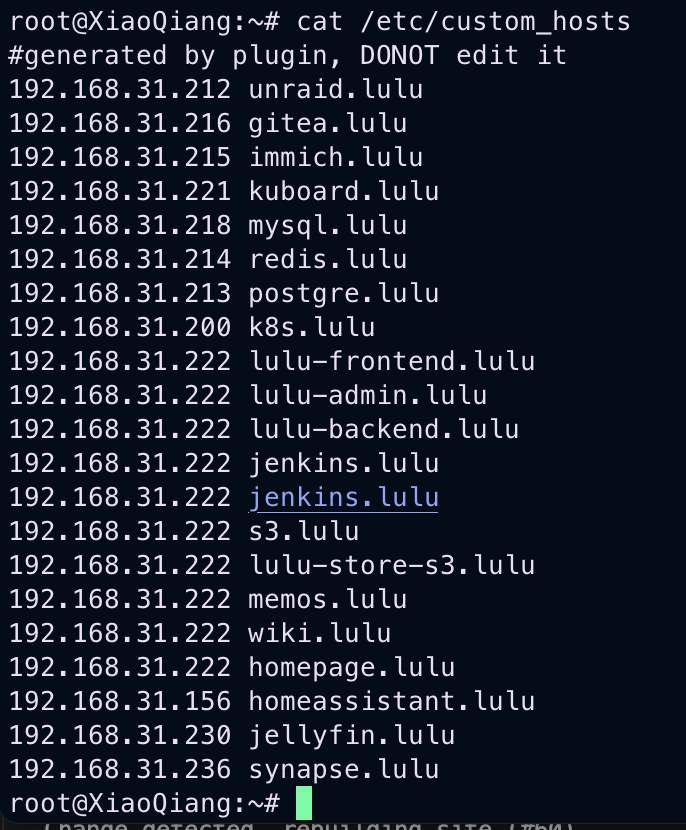
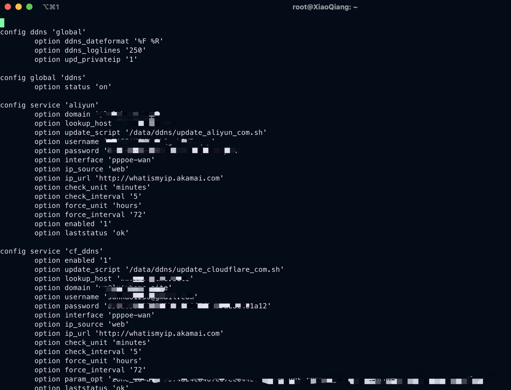
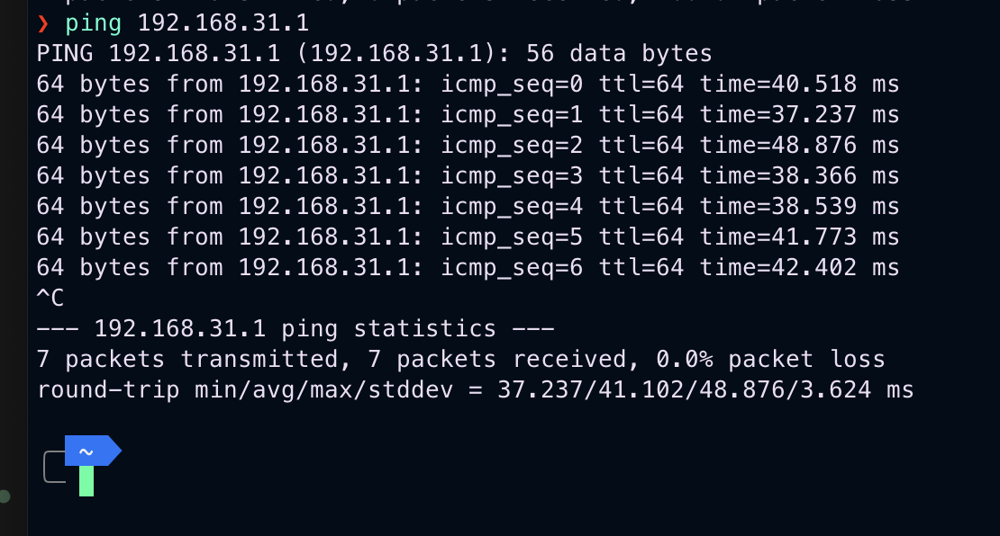
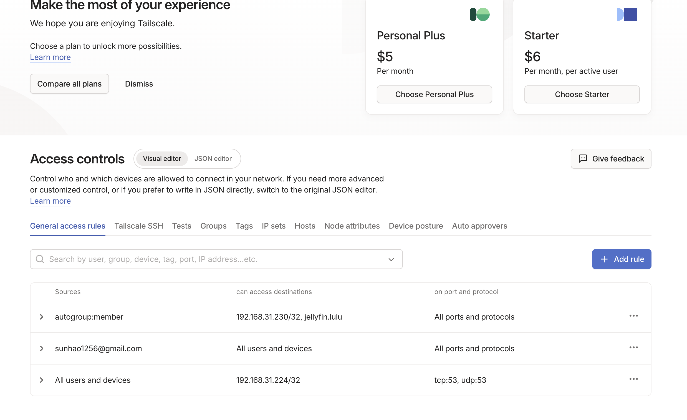

## 引言

随着家中联网设备和服务的不断增加，一个稳定、高效且能灵活进行远程访问的网络方案变得愈发重要。本文将分享我目前的家庭网络架构，重点探讨如何在保留品牌 Mesh 功能的同时，实现高性能的异地组网与网络优化。

## 硬件配置

### 核心路由与 Mesh 组网
*   **主体路由**：红米 AX6000
*   **子路由**：小米 AX6000
*   **方案**：采用两台设备组建 Mesh 这种方案在兼顾覆盖范围的同时，也能满足内网千兆无线传输的需求。

## 远程访问方案

对于家庭网络而言，**公网 IP** 是提升体验的基石。相比于昂贵且带宽有限的云服务器中转，公网 IP 能够直接跑满家庭宽带的上传带宽，是实现高质量远程访问的前提。

### 基于官方固件的深度定制
为了保留小米原厂固件稳定的 Mesh 功能，我没有选择刷入全功能的 OpenWrt，而是在官方固件基础上进行了「微手术」：

1.  **开启 SSH**：这是所有高级配置的基础。
2.  **WireGuard 集成**：通过 [wireguard-go](https://github.com/WireGuard/wireguard-go) 在路由器端实现 VPN 服务。参考了恩山论坛的相关教程（[小米AX6000系列开启WireGuard](https://www.right.com.cn/forum/thread-8268253-1-1.html)），在保证稳定性的前提下实现了极高的传输效率。
3.  **自定义 DNS (Dnsmasq)**：小米固件底层基于 OpenWrt，因此天然支持 `dnsmasq`。我通过修改 `/etc/custom_hosts` 实现内网域名的就近解析。




4.  **动态域名解析 (DDNS)**：官方固件内置的解析服务有限，我通过自定义脚本实现了 阿里云 和 Cloudflare 的集成。



> 相关脚本参考：
> [Cloudflare DDNS](https://github.com/openwrt/packages/blob/master/net/ddns-scripts/files/usr/lib/ddns/update_cloudflare_com_v4.sh)  /
> [Aliyun DDNS](https://github.com/openwrt/packages/blob/master/net/ddns-scripts/files/usr/lib/ddns/update_aliyun_com.sh)

## 客户端接入优化

为了让远程访问如同在内网一样丝滑，客户端的配置也经过了精心设计：

### 移动端（iOS）
我使用 **Stash** 配置 WireGuard 规则。这里有一个关键细节：**必须配置 SSID 识别**。当系统检测到当前处于家庭 Wi-Fi 时，对应的域名或 IP 会自动切换到 `DIRECT` 模式，避免流量在公网绕路。

```yaml
# 示例配置片段
proxies:
  - {name: "WireGuard Home", type: wireguard, server: "YOUR_DOMAIN", port: 51820, ip: "xxxx", private-key: "xxx", public-key: "xxx", udp: true, dns: ["192.168.31.1"]}

proxy-groups:
  - name: lulu
    type: select
    proxies:
      - WireGuard
      - DIRECT
    ssid-policy:
      erase1: DIRECT
      璐璐的家: DIRECT
      璐璐的家_5G: DIRECT
```


### 电脑端（macOS）
Mac 端我直接使用 **WireGuard 官方客户端**。相比于 ClashX Pro 等基于 HTTP/Socks 代理的方案，WireGuard 提供的隧道级访问更底层，能够让 DNS 直接指向家里的路由器，使用体验基本等同于局域网。

## 性能测试

经过実测，在外部 4G/5G 环境下回访家中的速度非常理想：
*   **延迟测试**：Ping 值稳定。



*   **流媒体测试**：使用 Infuse 播放 NAS 上的 Jellyfin 4K 蓝光片源，能够轻松跑满 50Mbps 的上传上限。


## 安全与进阶：Tailscale 的引入

虽然 WireGuard 性能出众，但它在多用户共享和权限管理方面较为繁琐。为了将家中的影片库分享给朋友，同时又不希望暴露核心端口，我引入了 **Tailscale**。

Tailscale 基于 WireGuard 协议，但在易用性和安全性上做了极大增强：
1.  **精细化访问控制 (ACL)**：我在 Unraid 上部署了 Tailscale，并配置了严格的 ACL 规则。
2.  **按需分享**：朋友只需安装 Tailscale，即可访问我授权的特定服务（如 Jellyfin），而无法触碰我的路由器管理后台或其他隐私数据。
3.  **网络中转旁路**：为了不污染主路由的 DNS 环境，我在 Unraid 中运行了一个轻量级的软路由虚拟机，专门负责特定的网络规则和解析。
4.  **网络直通，在有公网的ip情况下是不会走 tailscale 的服务器的**和直接wg没任何区别。





## 总结

目前的方案在「大厂固件的稳定性」与「开源社区的灵活性」之间找到了平衡：
*   **小米 Mesh** 负责家中的稳定无线覆盖；
*   **WireGuard + 公网 IP** 满足我个人的高性能远程访问需求；
*   **Tailscale + ACL** 则解决了安全的对外分享与多用户管理问题。

这套架构目前运行极其稳定，基本实现了「无论身在何处，家就在指尖」的网络初衷。

