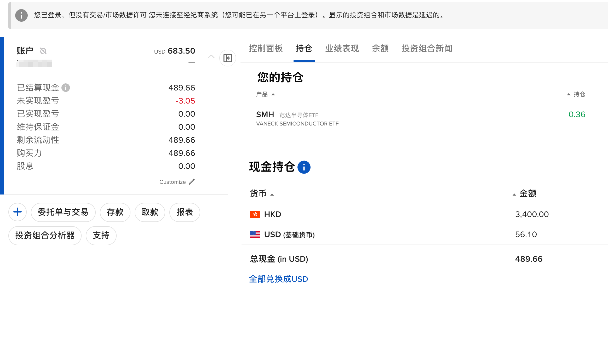

## 成品

## 背景

有一天NS上摸鱼呢，突然有老哥说IBKR开放了，能注册了。我以为什么羊毛呢，跟着就去注册，这玩意儿可真难开。国内证明根本不行，按老哥说的直接用身份证和个税，根本过不去，我就放弃了。过了两天又想试一下，这次用了护照和万里汇。也没报什么希望，就扔那了，没想到过了。

## 开户

就是按网上的教程，核心就是那个境外地址，我用的万里汇，感觉我能过还有一个原因，我是用的护照而不是身份证，而且护照开出来的是PRO账户.后来才知道IBKR好像真的很难开，这个账号倒是来之不易的。

## 入金
我以为开户困难就算了，入金才是真困难，特别对我来说。
先说结论，入金最划算，最简单的就是，国内RMB->跨境支付通->港卡->IBKR->自动换汇

### ifast，wise，寰宇卡
港卡其实对别人挺简单，对我很麻烦，因为我家里有小孩，离不开。最近的机场还出了活动，直飞香港来回800.直接去办了港澳通行证，想直接冲的，被老婆拦下来。

后来去捣鼓无港卡入金，寰宇卡购汇ifast，再入金，怎么说呢，都很麻烦，先说寰宇卡，ifast超过100英镑就是11英镑手续费，不超过100不收手续费，但是就3次，会风控要你提交材料了。wise我就直接去试，一个道理，都是英国账户。听说兴业直接把wise虚拟银行拉黑了。

这条路通也没啥意义，手续费太高。咨询了很多人，结论都是港卡。

### 港卡开户，内地见证
有IBKR没法入金，多难受啊，最后确实去办了港澳通行证和签注，准备冲了。夜里出发，下午就回，但是看了老婆孩子，孩子太小算了。不去了，不玩了。
然而天天刷到美股就头疼，后来得知还有一种，内地见证开户的方式。
搜了下，渣打、汇丰，50w，6个月，律师见证。小红书的集美们都这么开，这么有钱的吗？是我太拉了可能，后来x上发现还有2家，大新和南洋商业，都是20w 6个月存款 + 长期签证。大新不收费，南洋收500手续费。

搜了下两个银行，南洋已经被中资收购了，相当于建行的下属，国内网点挺多的，挺靠谱的，大新好像主要服务香港人员，网点少，不过江苏的镇江有个网点，挺奇怪，两个银行都打了电话，可开。

20w还是可以凑凑的，6个月利息，1450. 还可以选择基金，必须A类，但是呢，手续费0.8,赎出0.1,哈人呢。

最后选择了南洋，身份证+护照+签证，准备好20w，提前把手机银行额度提高，不然转账被限额。

#### 签证
提一下签证，长期签证90天，多次往返，比如日本的3年多次，想到现在日签这么贵，就应该去年去玩的时候开3年多次。有人推荐韩国，挺贵啊，淘宝也要快1k了。搜了下，也有便宜的地方，我直接就是免费，我选的尼泊尔，自己申请就行了，记着是90天，长期的，多次往返。并且南洋如果因为你资料不正确，没开户成功的话，500不退的，内地只是帮你提交材料，审核还是南洋香港过的。

#### 跨境支付通
当天下午，南洋就开户成功了，然后要设置一个保安码，第二天我就尝试跨境支付通，中行、建行、兴业银行全部失败，我直接问南洋中国客服，推给我电话，自己打香港的，他们不管了。打了N个，香港的客服，听你普通话态度是真不咋的。最后让我打支行电话。等回复。等回复的时候，我试了招行，成功了。就没理他们了。

#### 南洋香港内地互通
> 南洋商业银行（中国）与香港南洋商业银行现已推出「南商快汇」（南商香港称为「南商直通快汇」）。
> 自今日（4月24日）起，自南商中国个人账户向南商香港的「南商快汇」，免收各项费用，全额到账。
>
> 自年初起，自南商香港个人账户向南商中国的「南商直通快汇」，免收各项费用，全额到账。
> 上述转账均不要求收款人为同名账户，
> 不要求客户等级。
> 自南商中国发起「南商快汇」跨境转账须经审核才可汇出。

正好出了这么个活动，和中银一样，但是我实际测试，香港到内地也是有是时间的，不是秒到，但也挺快，1小时不到。也是占用每年5w额度的。可以出金考虑。

### IBKR入金
我以为有了港卡就很简单了，也没去搜教程，直接就冲了，edda绑不上，和网上的问题不一样，我在南洋后台看到了记录，但是被拒绝了，我估计是因为IBKR账户我填错了，我的账户中文，而且姓名反了，提了申请尝试变更后再试试，然后直接用fps汇款了。半小时不到把，就到账了。

### IBKR下单
入金成功后，还有坑呢，IBKR是真的复杂啊，youtube上蛮多教程可以看看。
主要如下几个坑
- 买股票不用提前转美金，IBKR如果是现金账户，会自动转汇，港币可以直接买美股，你提前转的话，要收2刀的手续费的，对于我测试的话，血亏，但是你大额也是2刀，比如要10w美金。这就相当划算了，这也是很多人想要IBKR账户的原因，它换汇最便宜
- 交易手续费，固定是是2刀，阶梯是是0.35,我小额，设置下这个，省钱的很。
- 挂单，各种操作，推荐看这个博主的[视频](https://www.youtube.com/watch?v=f3Gax6YHDh8),挺好的
- IBKR好像是唯一支持定投的美股券商，而且功能也是新出的，在交易里有一个定期交易。我这种小白就直接定投VOO和QQQM了。

### CRS
这个嘛，开出来的户就直接美国的，听说不参与，其次，我这种几千RMB的，老哥们叫我赚起码10w再考虑。。但是该交税还是要交税啊。

## 总结

这一路是真的难，没薅过这么难的“羊毛”。其实支撑我一直想开户原因是，看到一个博主说了一句，互联网有城墙，金融也是有的，而港卡是打开这个的唯一钥匙，随着政策收紧以后可能没机会了。

此外，我老婆一直玩大A，老师吐槽限购，去年的白银啊，今年的美股基金啊。现在有IBKR了，直接场内。所以特别想开。

开了了解到了定投，总之对我这种国内银行1点多利息的人来说，还是不错滴。

后面可能要好好学习下美股了，股市有风险，交易需谨慎。