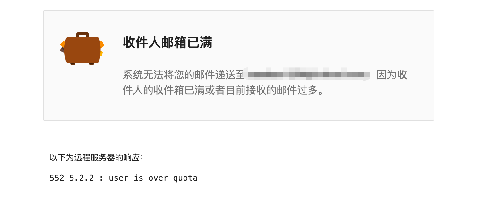

## 背景

我icloud最近迁移到了日区。国区的订阅就关闭了，然后icloud就爆了，我的一个google账号绑定的icloud邮箱。发邮件的时候直接提示邮箱满了。
然后登上国区，icloud网页上只能1000一次操作，这么多照片咋删除，并且发现有些照片没有同步到新的日区，想着顺手同步到immich。

## 迁移方案

reddit 上有[方案](https://www.reddit.com/r/immich/comments/1pdvy1d/best_way_to_migrate_from_icloud_photos_to_immich/)

利用[icloudpd](https://github.com/icloud-photos-downloader/icloud_photos_downloader) 下载到本地，再用 [immich-go](https://github.com/simulot/immich-go)导入到immich里。

## 执行命令

### icloud下载到本地

docker run -it --rm --name icloudpd -v $(pwd)/Photos:/data -e TZ=Asia/Shanghai  icloudpd/icloudpd:latest icloudpd --directory /data --domain cn  --username xx@xxx.com --watch-with-interval 3600

这里要加--domain cn，-e TZ=Asia/Shanghai。毕竟你的照片在云上贵州呢🤣

### immich-go导入 immich

./immich-go upload from-folder \
  --server=http://xxx \
  --api-key=xxxx \
  --recursive \
  --manage-heic-jpeg=StackCoverJPG \
  --session-tag \
  --on-errors=continue \
  --client-timeout=60m \
  ./Photos

### 删除icloud
docker run -it --rm \
  --name icloudpd-delete \
  -v $(pwd)/Photos:/data \
  -v ~/.icloudpd/cookies:/cookies \
  -e TZ=Asia/Shanghai \
  icloudpd/icloudpd:latest \
  icloudpd \
    --directory /data \
    --cookie-directory /cookies \
    --domain cn \
    --username xxxx\
    --keep-icloud-recent-days 0

这里的keep-icloud-recent-days 0 直接0了，一般保留30

