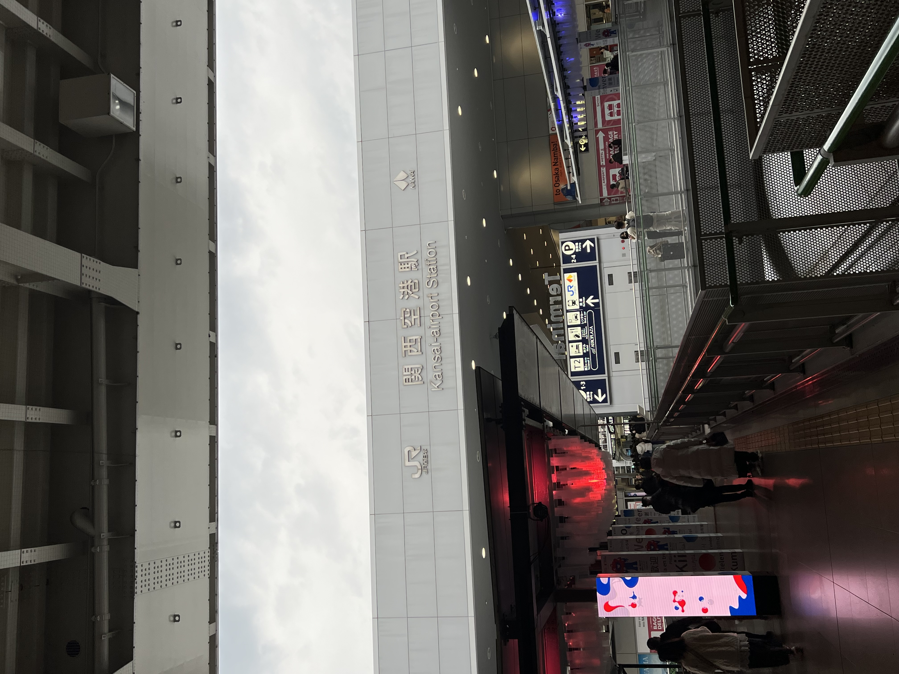
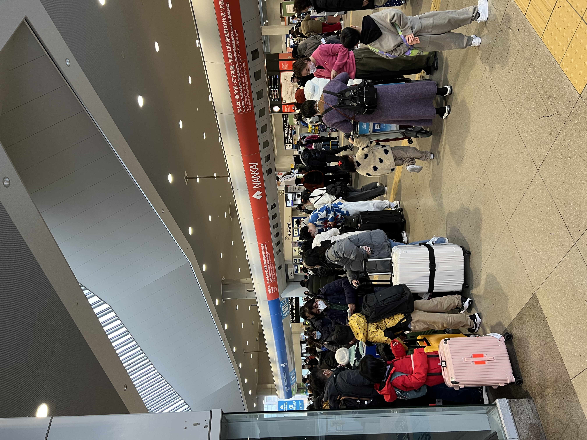
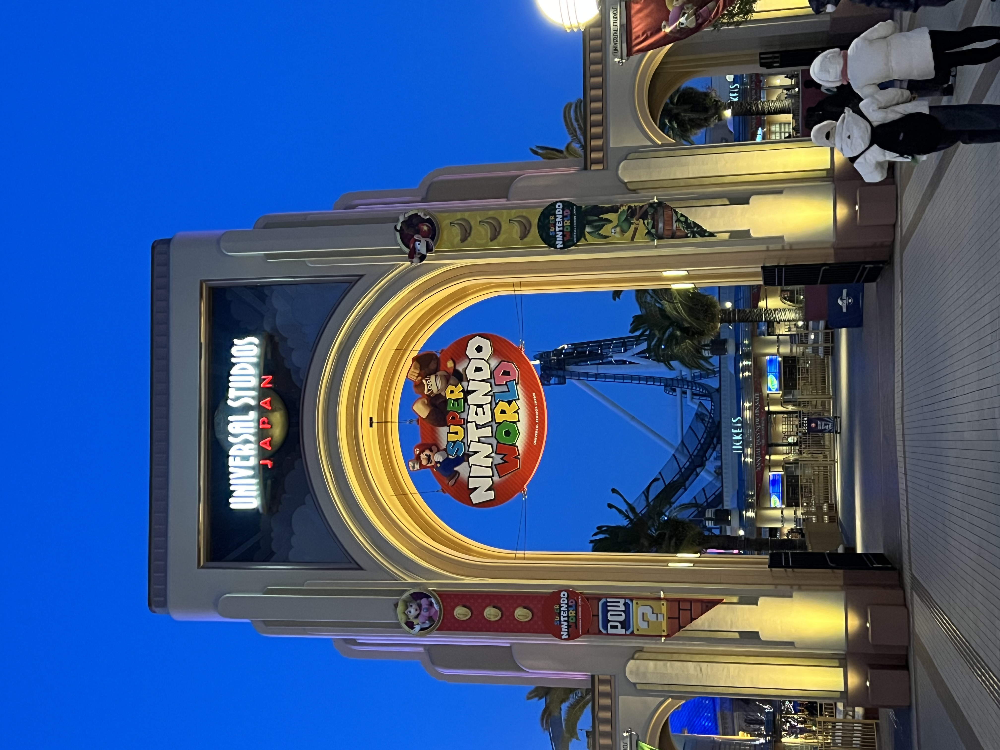
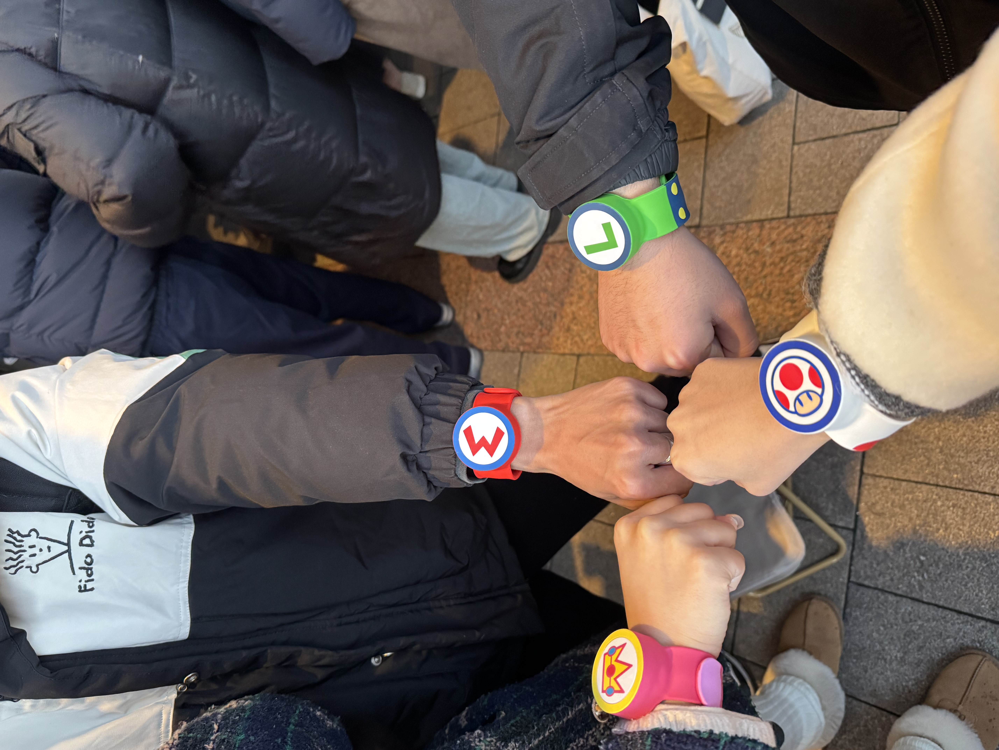
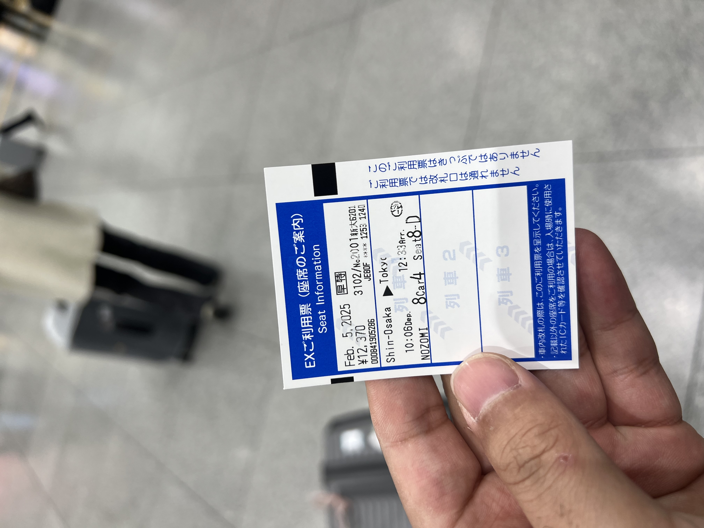
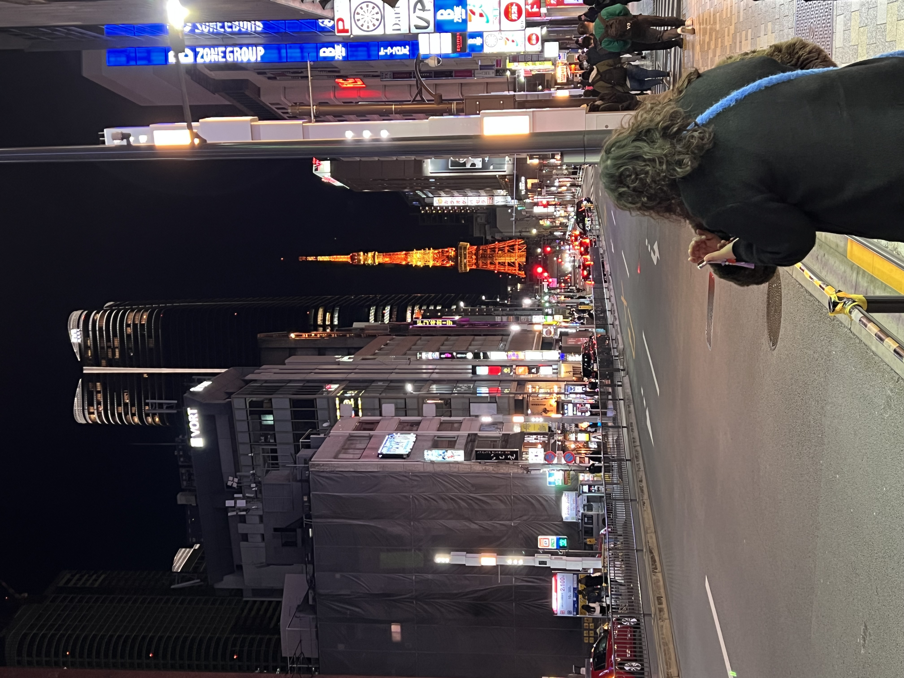
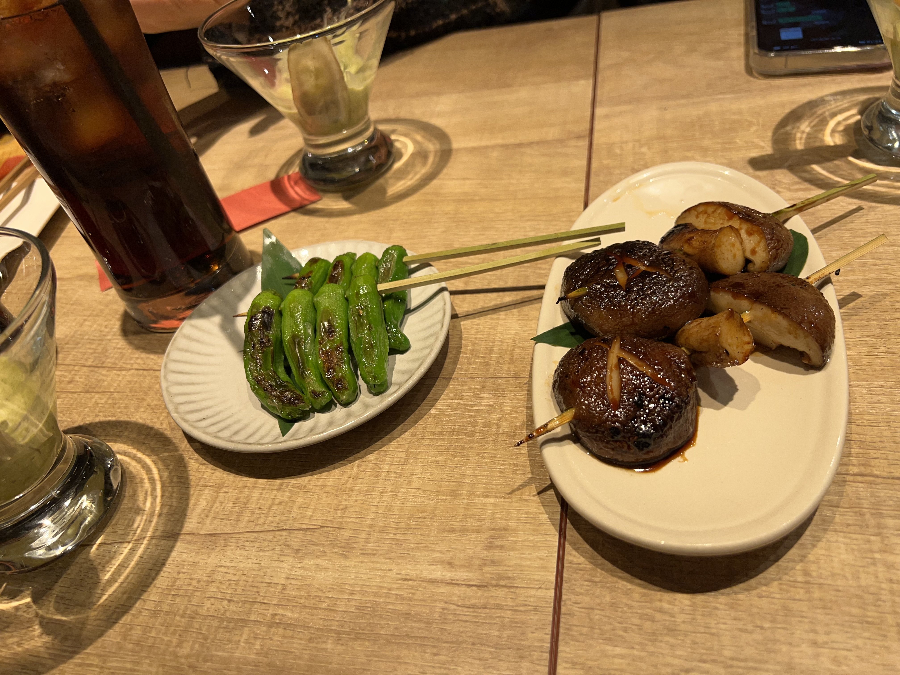
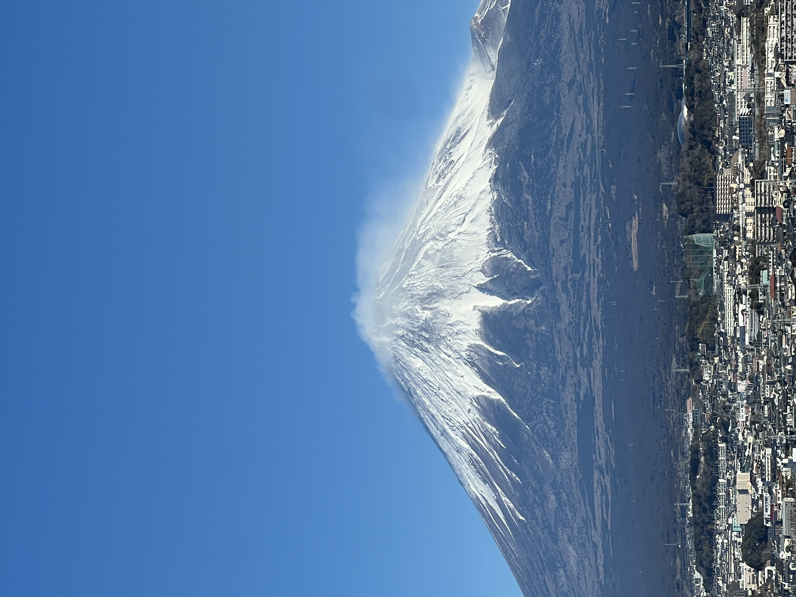


## 出行计划
2024年10月份吧，那个时候没有孩子，没有烦恼。应该是刷到了日本的长野县，我记得是柯南里的一集案件。突然奇想想去一次日本，或者说从来没出过国，首次出国就献给日本吧。于是乎就开始了计划。

除了我和我老婆还有一对朋友。第一天提的方案，下周我就去办理了自己的护照。

计划定在了2025年春节，2月3日-2月10日。

爆发出了J人的性格，我直接用notion写了份[计划](https://spangle-measure-e08.notion.site/Japan-2025-7-8-172ade55c4768099b75bd6a5664828cd),涵盖了吃喝玩乐，交通，住宿，预算等等。

我依稀记得，前一天晚上的激动心情，我恐飞，但是那次从无锡到大阪的飞行，我竟然一点都不紧张。

## 大阪
当我抵达关西机场的时候，那种不真实的感觉油然而生。从小看到大的动漫世界，就在脚下。“意外熟练”的走向了售票机器，我们提前在Klook上关西空巷到天王寺的+USJ套票。

看着那些机器上的英文，我突然发现，原来我英语还可以呢，意外顺理的取票。人工检票，说了人生首句国”Thank You“。

晚上抵达酒店，吃了第一顿拉面，还是在tablelog上找的，果然有传说中的”臭猪味“，并没有很惊艳，我们住在梅田附近，因为关西和关东的差异，导致我在后面去东京的时候，小小心灵被狠狠的震撼了。





## USJ
USJ,因为以前去过上迪，我以为会和上迪差不多的，但是马里奥乐园简直是无与伦比。我提前在闲鱼租好了手环。真的有手环，和没手环区别太大了。特别是最后的酷霸王，没有手环根本没法玩。

我们2月份，顶门到达，一进门，大家就冲向了马里奥乐园，我和我老婆跟着人流冲向了咚奇刚。因为背后有一个台湾腔”猴纸在那里？“，太好笑了。

托他的福，确实应该一进门就玩上咚奇刚，不然后面排队要排死。



中午的马里奥餐厅也是圆满的吃上啦，马里奥真的很值得去的。









## 东京

在大阪只呆了两天，提前在smartEx上买了新干线票。国内想买个票是真的难，又是梯子又是visa，折腾了半天。

路上看到第一眼的富士山，真的令人震撼，那种和图片上的感觉不一样的。
此外新干线和国内的高铁还是有很大差别的，空间，安静，后来我才了解到，原来高铁就是购买日本的新干线来的。

东京站，这么复杂的线路，回看国内南京南号称最大了，大巫见小巫。






### 六本木的东京塔和烧鸟

迷人的六本木，烧鸟也还不错，有一说一，国内烧烤还是好吃的。

第二天的早餐，我真的爱吃cup拉面，可惜国内买的味道不一样。

### 秋叶原和浅草寺

圣地巡礼之一，秋叶原！
一番赏抽到了B赏，开心！



### 涩谷与新宿

这里是世界上最繁忙的路口吗？仿佛生化危机的开端。但我眼中看到的只有繁华——一种和上海完全不同的繁华感，显得更为“高端”一些。这种感觉体现在细微之处，比如“吸烟区”。作为一个长期生活在大厦中的人，这种有条不紊的秩序感让我印象深刻。









### 台场：梦幻的海滨与未来之城

台场原本是在规划时临时加进去的，起初并没有抱太高的期望，只是想去看看《数码宝贝》的取景地。但当我真正踏上那片土地时，脑子里只有一个想法：想在这里买房。

这里和东京的其他城区完全不同，仿佛是一个“新世界”。如果一定要描述，那就是“未来之城”。它不像新宿、涩谷那样拥挤急促，这里视野开阔，海滨公园、彩虹大桥与自由女神像交相辉映。那天天气格外好，天与海都是纯粹的蔚蓝。

顺利打卡了《数码宝贝》的取景地，仿佛和童年完成了一次跨时空的合影。





## 静冈与富士山

最后一站我们选择了静冈。如果说大阪和东京是现代文明的巅峰，那么到达富士山周边时，那种古朴的日本气息便扑面而来。

虽然到处都能看到岁月的痕迹，但街道极度整洁。即使是乡下，那种一尘不染的透明感依然令人感叹。这种对公共环境的维护意识，确实值得我们深思。



## 终章：旅行的意义

有人说日本旅行的“戒断反应”会持续很久，我想我可能已经无法完全“戒断”了。

从小被灌输的刻板印象让我曾对这里充满成见，甚至一度心生排斥。但这次亲自踏足，用双眼去观察，用双脚去丈量，让我对这个邻国有了全新的认识。或许这就是旅行真正的意义：打破信息茧房，眼见为实。

这次旅程还让我明白了一些别的事情——那些深藏在心底，却又无法宣之于口的事情。

