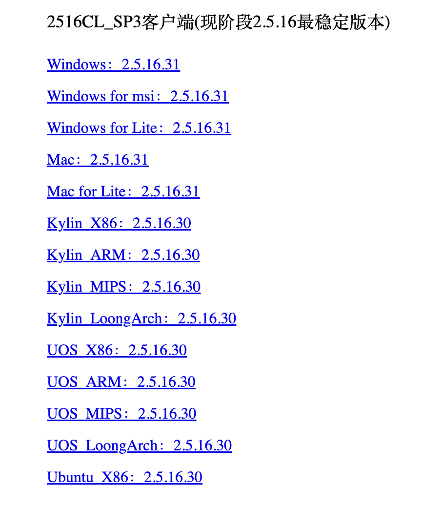
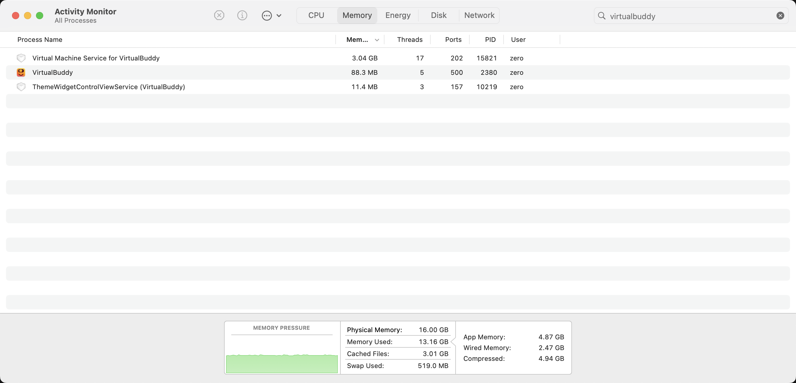
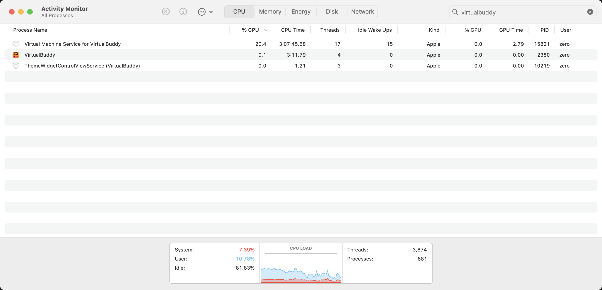

## 前言

碍于公司网络限制，我在工作的时候使用自己电脑，然后rdp到公司电脑，平时自己捣鼓东西，就用流量，不违反公司规章。那些自己打洞的方案建议别考虑，还是小心丢饭碗。
然鹅，突然上周某一天，rdp连接不上了。最后发现是atrust的问题。

atrust和easy-connect，众所周知，咱就不多说了。我使用rdp的还有一大主要愿意是，工作需要atrust链接特殊内网。这玩意儿装到自己电脑就完蛋了，在家里我是装在一台windows的虚机上。

我立刻测试了一下，断开atrust，rdp就自动连上了，一起动atrust就失败。然后我rdp到家里的windows虚机上。一模一样。大呼，“完蛋”，这下G了。

还有个原因，atrust，号称“零信任”，妈的，启动后就断所有外网了，微信都登不上。这年头。我就不说gpt，gemini了，baidu，google不给你用，谁受得了啊。

直接就是天塌了。

## 方案调研

### docker

在公司刚要求使用atrust的时候，我就调研过这玩意儿。有这么个项目[docker-easyconnect](https://github.com/docker-easyconnect/docker-easyconnect),这里首先感谢开源精神。
感谢作者。

然而这个对我没有用，我遇到和这位同学一样的问题https://github.com/docker-easyconnect/docker-easyconnect/issues/438 

### debian虚机
以前我尝试过将[官方的client](https://atrustcdn.sangfor.com/tools/clientVersion/index.html)安装到debian里

支持arm的只有Kylin和Uos，我试了下Kylin，是可以安装到debian11上的，但是我的场景需要虚拟化组件，下载的时候日志提示系统debian
not support，看来只能修改os的相关信息，伪装成kylin才可以安装，如果不需要虚拟化组件的场景，就没问题了。

### macos虚机
当docker失败的时候，我就想过应该用虚拟机，我首先尝试了windows，安装tiny11,然而虚拟网络不支持arm的windows。官方也没有支持arm的windows组件。头疼。所以后来才会使用rdp方式去链接工作机，去办公。改天讨论下rdp的fps问题。

为啥从没考虑macos虚机，因为我从没想过macos套macos会咋样，肯定卡的不行把，或者说资源消耗过大。但眼下别无选择，开始调研方案。

- 老牌Parallel
商用的自然好用，但是费钱，而且使用起来就这样。
- UTM
好像依然基于Qemu，没VirtualBuddy省资源
- VirtualBuddy
开源，且使用苹果自己的虚拟化，最省资源。

最终选择了VirtualBuddy，但是吧，资源还是停消耗的，2g，卡的不行，至少要3g。

### socks5配置

这里有个误区，我以为需要开启tun模式，实际上不用，而且为什么rdp会被atrust封，但是socks就不会，其实是因为socks和atrust在一个内部局域网里好像。不会被检测。所以**切忌macos开tun模式**，至于怎么开socks，我是直接用的clashx pro。

### 宿主机配置
http请求就不用说了，分流一下就行了。问题是我还有一个软件，需要走socks，这个其和之前的antigravity配置一样，使用Proxifier就可以了。

将涉及到的所有app，包括一些bin的脚本，配置成虚机的socks5端口即可。

最后附上virtualbuddy的消耗。

