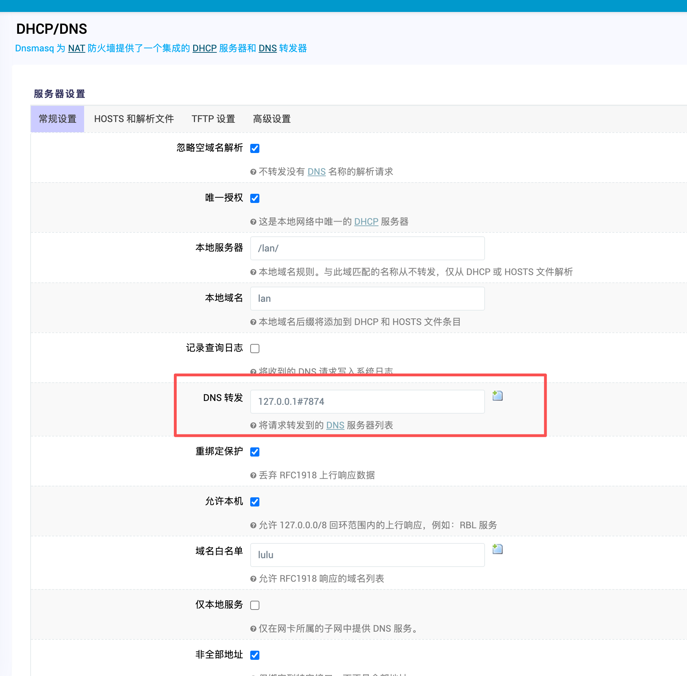
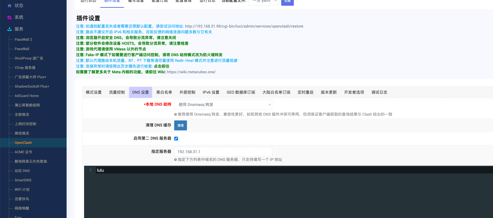
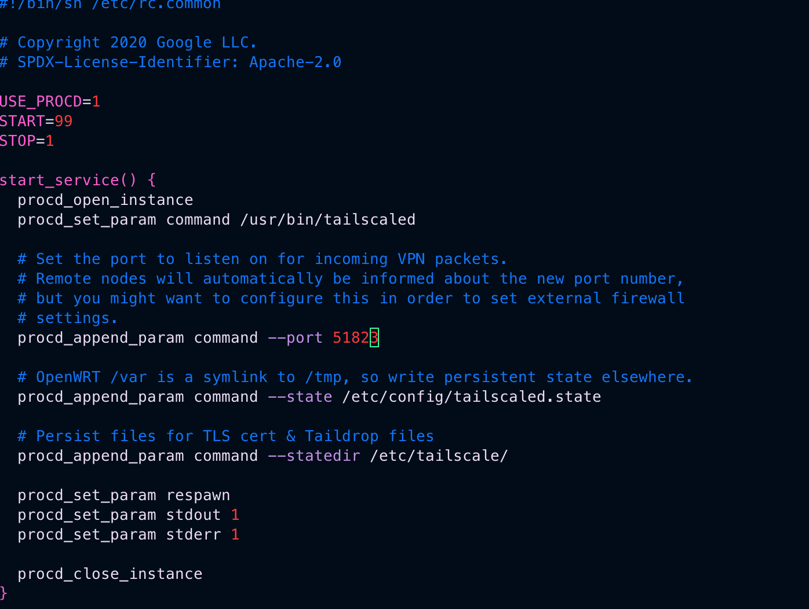
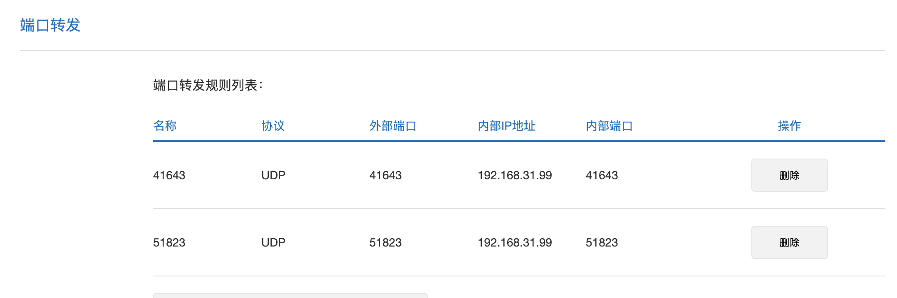
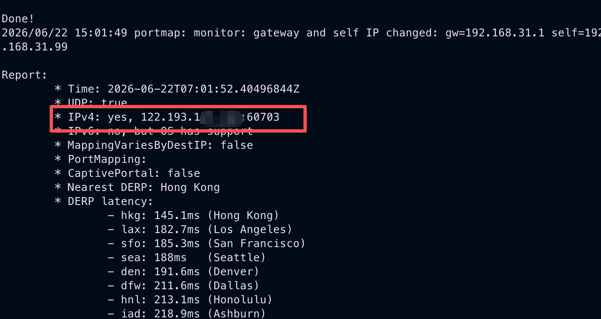
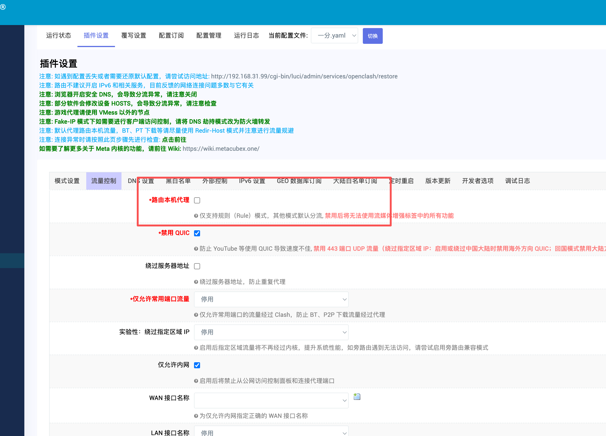
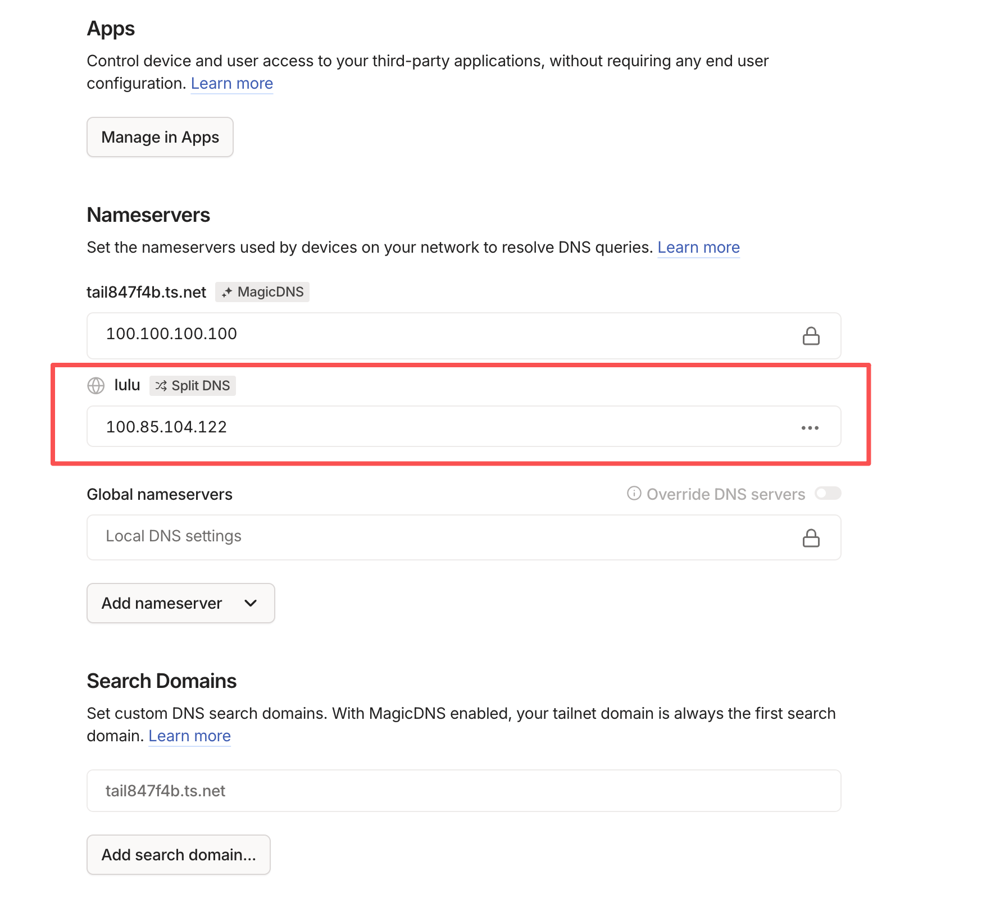
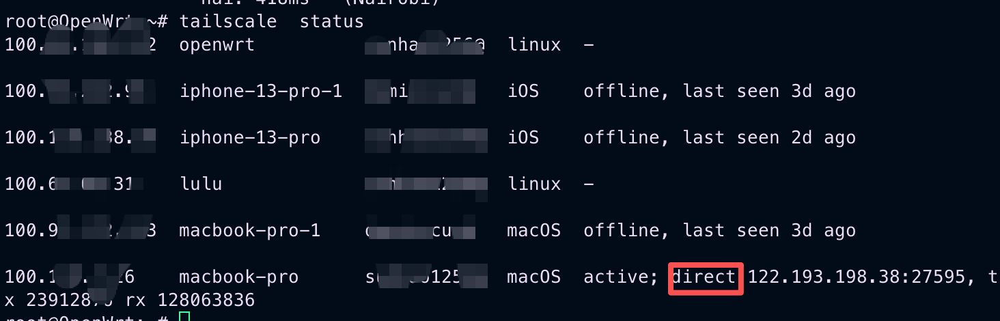
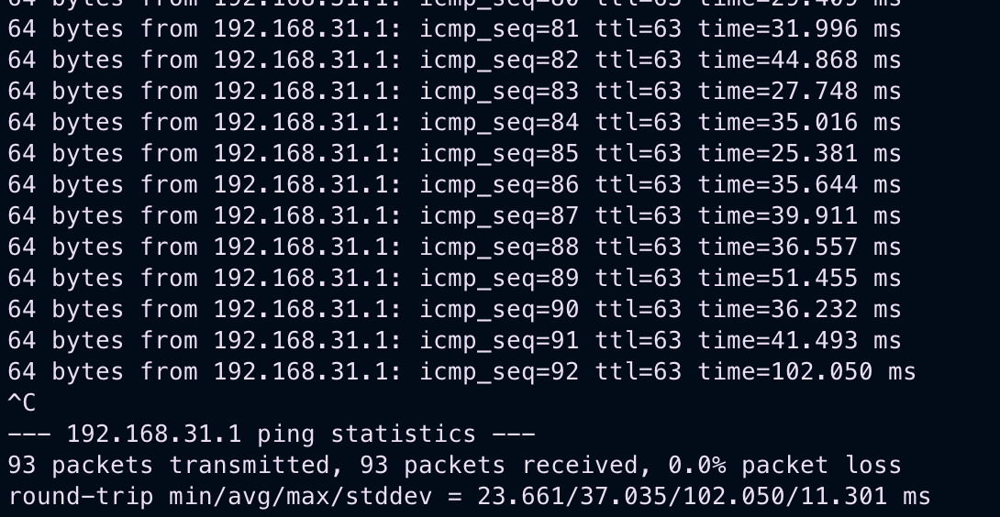

## 前言
以前一直没时间捣鼓网络。之前其实家里科学上网的主要是自己手机，mac这些，都是本地安装的client。但是有的时候确实很烦，每个设备都安装一遍，就光订阅节点都很麻烦。特别是unraid每次跑新的镜像，要是镜像站给力点还行，要么太慢，要么打不开，搞不懂GFW一定要ban dockerhub干嘛。以前呢我是在红米ax6000上跑了clash，其实这样不好，ax6000没多强，上面还跑了wg。有一天，突然下载速度限制在了100M，我怎么都找不出原因，从来不怀疑是ax6000的问题。最后为了排除这个可能，我把ax9000拿过来试了下，还真是，后来就打算路由器组mesh就组mesh不在上面雕花了。因此得找个东西当旁路由，这样unraid以及我新入的appletv就不用再装client了。

## N1
这玩意儿已经很成熟了，电视盒子啥的，也能当nas用，各大论坛也都推荐这个，主要是千兆宽带下性价比最高。
99拿了个新的。


### 刷机
这个东西必须刷机，参考[恩山F大佬的帖子](https://www.right.com.cn/forum/thread-4076037-1-1.html)就可以了。
刷机过程中有几个重要点。

- u盘插hdmi隔壁那个口
- 我的固件很新，需要用[工具](https://github.com/sorrymyself/P1-N1)先降级。
- 开启adb是点击版本号4次
- 刷完机后记得install到emmc

这个[帖子](https://zhuanlan.zhihu.com/p/19160274896)做主要参考 

## openclash
F大佬的固件里带的openclash已经老了，新的例如，anytls协议都是不支持的，内核还是clash而不是meta。手动升级就行了。网上很多帖子都过时了，不需要去做那些复杂的事情。直接用openwrt的opkg处理就行了。

删除原有的openclash
```shell
/etc/init.d/openclash stop
/etc/init.d/openclash disable

opkg remove luci-app-openclash
```

使用openclash官方的[命令](https://github.com/vernesong/OpenClash/releases)安装即可
直接用# [iptables for ipk] 就行了

### DNS配置

这里我不是很想让家里的设备全部都dns转发到op上，因此在ax9000上的dhcp的dns还是31.1. 但是我内网的lulu域名解析是由ax9000提供的。所以需要配置一下op的dns。将lulu的域名解析转发给31.1

这里有个坑。就是默认的OpenClash会劫持本机的Dnsmasq。所以自定义域名配置需要在openclash里配置，而不是在op的网络里，如果在op网络里写，openclash会过会儿覆盖了。

如图，不能在这里配置。



而是在这里配置的。



### 自动科学
这个没去配置，简单说就是关闭ax9000的dhcp，让op提供dhcp，然后把网关和dns都改成op就可以了。不过我觉得接入wifi就能直接科学不太好。所以向上网的设备就直接手动改一网关和dns就行了。

## tailscale
之前我回家的主要方式是，在ax9000上起的wg。参考[我家的网络方案](https://blog.luluhome.site/p/%E6%88%91%E7%9A%84%E5%AE%B6%E5%BA%AD%E7%BD%91%E7%BB%9C%E6%96%B9%E6%A1%88/)
其实用着没啥问题，但是wg太原始了。最大的痛点就是权限，现在ai最方便的使用就是部署一个中转，多接几个gpt号。有公网ip谁还买云服务器部署呢。所以我是在家里跑的sub2api。wg连上去干活的。现在有个需求，我老婆，我朋友他们也想接入。我总不能去为了这个买个境外vps吧。太花钱了，所以和我一样接入家里的内网就可以了。手动配置wg的权限太麻烦了，还不能动态变更。所以tailscale就必须要安排上了。

之前我除了自己的wg，为了给朋友看nas的资源，我已经在unraid跑了tailscale，现在有op了，所以得迁移一下。

### 安装

使用[这个项目](https://github.com/adyanth/openwrt-tailscale-enabler)安装过程就按参考readme就可以了。

核心命令就是
```shell
/etc/init.d/tailscale start
tailscale up --accept-dns=false --advertise-routes=10.0.0.0/24 // 这里开放自己想要的子网比如我的192.168.31.0/24
```
作者没提供修改port，修改port直接就修改/etc/init.d/tailscale就可以了，在shell脚本里有的。




别忘记到主路由器那边把udp转发到op。



有公网ip，一定要netcheck一下，确保对外的ipv4是你的公网ip。



**openclash踩坑**

默认情况下openclash会给本地机器也走代理的，所以去netcheck的时候，如果规则不合适的话，会显示你的ipv4是别的ip。这个坑，我捣鼓了半天，最后发现netcheck一直是日本ip。我说为啥一直走中继节点。而不是直连，而且这里很坑的是，tailscale一开始走的direct，然后断开重连后就一直走中继了，花了能有2个小时，我都怀疑是运营商搞得鬼，服了。

去除**路由本机代理**这个选项。当然如果你的op需要走代理的话，做好规则就行了。



### tailscale dns配置

因为我有内网域名解析的需求，所以要让各个设备能正确访问的话，得让tailscale指定lulu域名的dns，到tailscale的后台添加dns。

添加一个split dns，指向op所在的tailscale网段分配的ip就可以了。这样朋友连接上tailscale，lulu的特殊域名，就会解析到op的机器，op通过上方在openclash配置的自定义域名解析，把解析请求转发给ax9000，这样就实现了内网域名解析。




### 测试
检查一下tailscale的状态，确保走的direct就行了。
*** shell
tailscale status
***



因为底层还是wg，只是多跳了一次op，和原生wg没太大区别。tailscale的权限控制简直了，我测试了下，admin页面修改rbac后，几秒就自动生效了，客户端无感，无需重连。



## 总结

整体迁移流程还可以，做完后，直接unraid的gatway换成op就可以了，不过pt保种的话，会限制openclash，最后我还是去掉了unraid的gateway配置。appletv以及windows都可以直接配置op进行上网了。