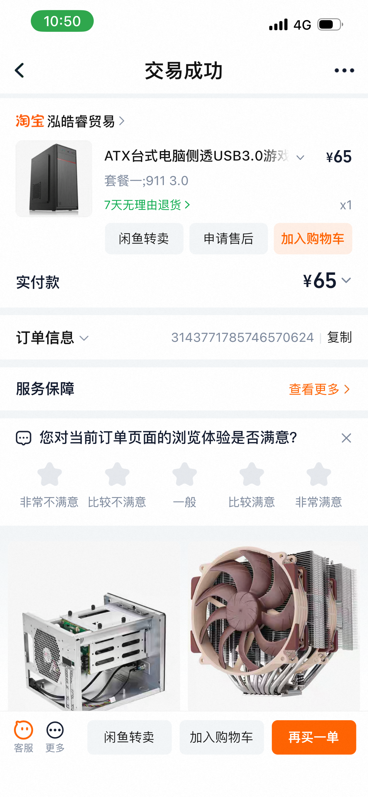
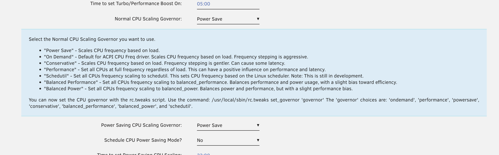
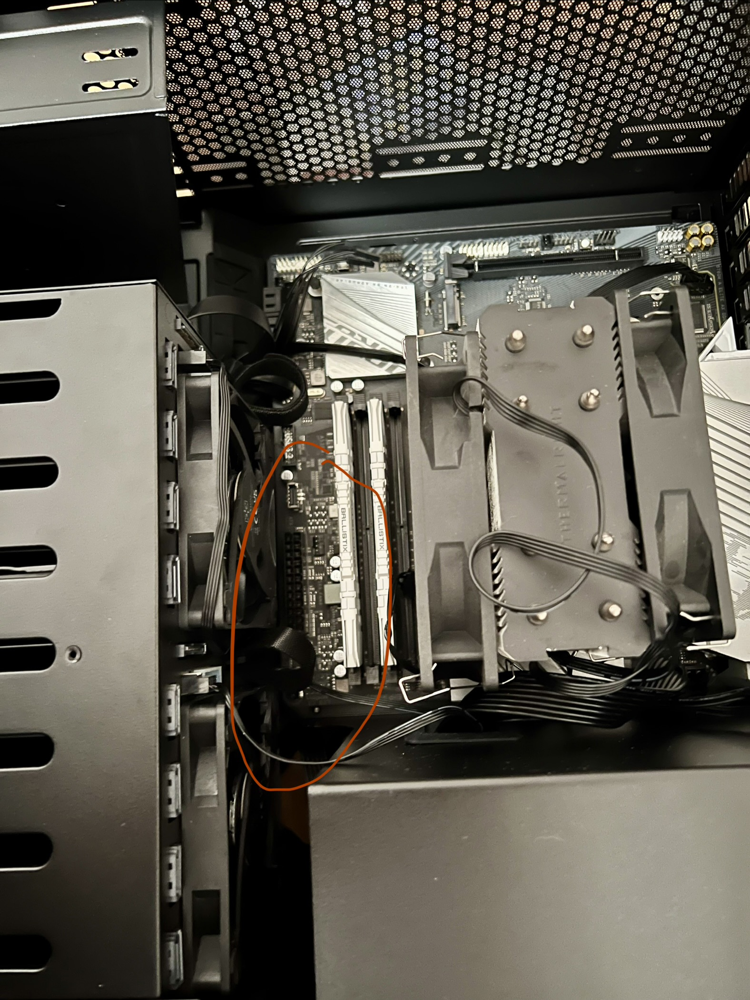
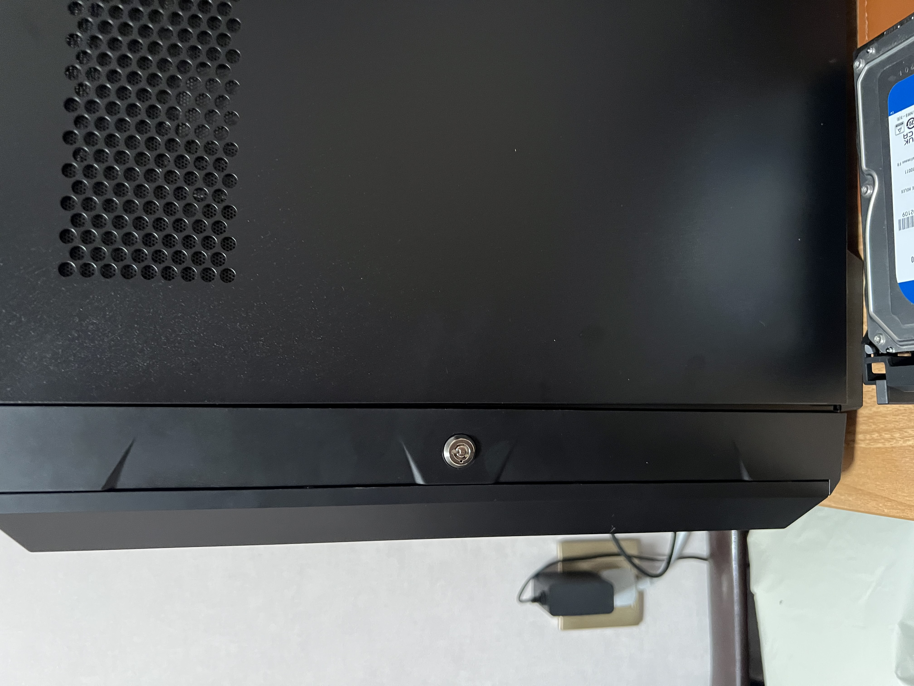
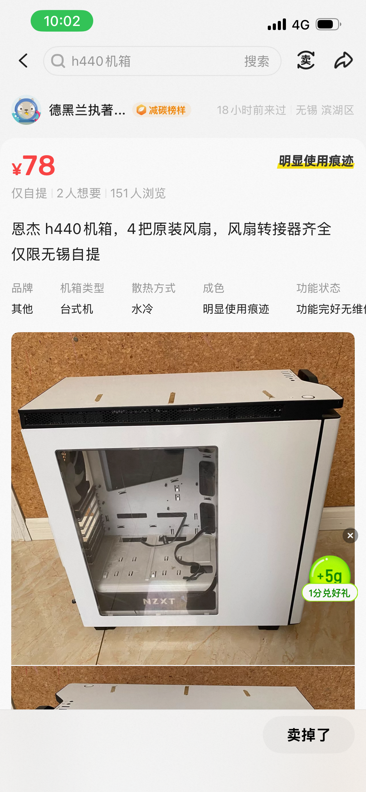
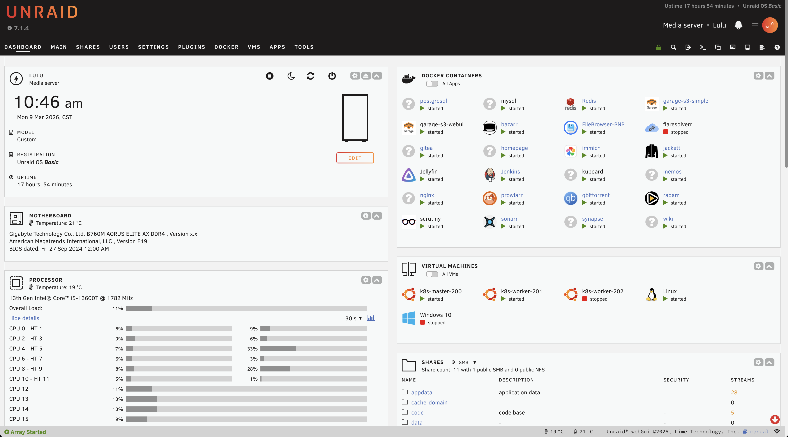

> **随笔**  
> 最近搞了 Nas 后下载了很多电影，自己很久没有安静下来不快进地看完整部电影了。重温了《天空之城》，每次都能被希达和巴鲁感动。或许是老了，变得感性了。

## 1. 背景与痛点

早在 2022 年，趁着 Unraid Basic 终身授权有活动时上了一波车，但后来由于种种原因一直搁置。最近想弄一台家用服务器，就把老丈人那里的一套 E3 “洋垃圾”给搬了回来。

之前的配置虽然能用，但那个及其简陋的电源成了最大的隐患。

### 现在的样子

原本以为我的 i5-13600T + B760M 平台即便功耗高点，待机也该在 30W 左右。结果实测发现，**天天待机都在 50W 以上**！被迫无奈只能设置夜间定时关机。后来和 Gemini 聊了聊才意识到，这个二手“辣鸡”电源的转换效率和待机表现简直是一场灾难。

### 需求
- ATX+MATX的机箱，热拔插非必要，质量要好，4盘位最好，因为我用不到更多的。而且unraid basic有硬件6个限制。
- ATX白金电源 ，大品牌安全。
- 功耗要低30w上下。

## 2. 升级方案

为了彻底解决功耗和存储扩展性问题，我决定进行一次“大手术”。

### 电源：稳定压倒一切
首先必须选一个靠谱的电源。在海鲜市场蹲了很久，最后淘到了一个**海韵 PRIME PX750**。对于 NAS 来说，白金效率是必须的，不仅是为了省电，更是为了 7x24 小时运行的稳定性。我觉得我这个价格是捡漏了的。



好电源就是不一样，什么都不变情况下，待机功耗只有42W 左右。

#### 电源功耗设置
gemini 建议unraid安装插件 TipsAndTweaks
核心参数是 Normal CPU Scaling Governor 配置为Power Save 基本降低15w。

gemini给的优化方案
| 优化维度 | 关键设置项 (BIOS 路径) | 推荐设定值 | 优化目的 |
| :--- | :--- | :--- | :--- |
| **CPU 核心省电** | **C-State Control** (Tweaker -> Advanced CPU) | **启用 (Enabled)** | 允许核心在闲置时关闭不必要的电路。 |
| **睡眠深度** | **Package C State Limit** (Tweaker -> Advanced CPU) | **C10** | 开启 13 代 CPU 最深层的省电模式。 |
| **总线节能** | **PEG / PCH / DMI ASPM** (Settings -> Platform Power) | **启用 (Enabled/L1)** | 降低 4070 Super 显卡和 NVMe 的待机功耗。 |
| **板载设备** | **Audio / Wi-Fi / BT** (Settings -> IO Ports) | **停用 (Disabled)** | 关闭不用的声卡和无线网卡，减少额外电流。 |
| **散热控制** | **Smart Fan 6 (Fan Stop)** (按 F6 进入) | **PWM 模式 + 停转** | 低负载时让机箱风扇完全停转，省下约 5-8W。 |
| **自动化方案** | **AC BACK (来电自启)** (Settings -> Platform Power) | **永远开启 (Always On)** | 绕过坏掉的 Power 键，接通电源即自动开机。 |

---

### 机箱：多盘位是刚需
再说说老丈人那个 50 块钱的“铁皮盒”，没有硬盘仓，略微离谱。 扩展性几乎为零。这次一步到位，选择了**银欣 CS382**。它拥有 8 个热插拔盘位，而且外观紧凑，散热设计也非常合理。

### 更新：辣鸡CS382
机箱我挑了很久，最后选择了**银欣 CS382**。它拥有 8 个热插拔盘位，而且外观紧凑，散热设计也非常合理。
主要是我的目前硬件需求是ATX电源+MATX的主板。

选到最后基本只有御夫座和银欣CS382、CS380还有SG02,珍宝系列支持。

其实Nas不是我的刚需，但多硬盘肯定是要的。热拔插也不是特别需要，有那是更好，这次下了血本，直接买了全新的CS382.

直接看视频，我也不是小白脸，以前还有健身的，我竟然拔不动，这热拔插，我尼玛手疼死了。买之前到处看到银欣机箱铁皮薄，不值价钱，我不信，毕竟大品牌，拿到手之后我服了，真的太垃圾了做工，用料一点都不值800快，顶多300。就为了他那块背板吗？太亏了。品牌形象打打折扣。

---



---

然后说说内部结构，官方明确支持matx主板，我的是技嘉的B760M小雕，主板电源根本就没法插，和硬盘笼卡在一块了。机箱内部紧凑了。

最后听说过cs380的风扇很大声，cs382,我开机太可怕了，风扇就是为了机房使用的。家庭环境噪音太大了。外加 机箱缝隙大，合不上

综上所述，退款

## 3. 新机箱的挑选

被CS382坑了以后，天天上班不再心思，一直看评测视频，其实我的需求里，这个机器不是纯Nas，我也用不到那么大的8盘位，顶多4盘位，此外我的主板也只有4个SATA。所以我更想要的是一个有4盘位，支持MATX+ATX的机箱，而不是Nas机箱，区别就是带热拔插。热拔插一年又有几次能换？
主要拿来跑vm，跑点docker才是我经常用的。我拿它来做开发环境，装openclaw。做软路由。

### 御夫座
御夫座我看了很多视频，确实不错，颜值，大小，matx+atx，存储空间6盘位，都挺好。准备下手了，但我是一个爱捡垃圾的，我还是再问我自己，需要500多的机箱吗？是值的，但我需要这样的Nas机箱吗？还是只是要一个多盘位的塔式就行了呢？所以没有下手，继续在官网。

### 恩杰H440
有天晚上，我正在海鲜市场挑菜，突然一款机箱映入眼前，虽然没看到背面，我猜测一定有竖着的一排硬盘仓，我立马去查了下资料，果然，原生自带5个盘位。隔音棉，做工优秀，质感，外观颜值，内部空间，双USB3.0。外加这个闲鱼价格，天呐，被我赶上狗屎运了，速速拿下。

离我上班很近，兴奋的不行。当晚就去拿了。到手灰尘很多，花了一天时间好好清理了一下，终于恢复了原本的面貌。

这颜值、这触感、这做工，背后的风扇集成板我都没见过，什么科技啊。开机按钮，这Logo大灯。这隔音棉，这防尘网，太棒了辣。 无敌。心满意足。

速速装机。点火，起飞。“嗯？”开机键坏了。我擦，赶紧试了一下Rest键，呼，还好是好的。嗯，满意，舒服了，我看着它运行了很久,心里真的很高兴，我可以花钱去买现成的机箱，但是这种捡到宝贝，自己折腾的感觉实在是太棒了。



---



## 总结
这次升级Nas的电源和机箱是我很久之前就想做的，以前的实在是太垃圾了。最后去了解了下历史，恩杰这个牌子，以前高端产品了，不知道现在怎么没落了，从我拿到机箱我就知道真的做工很棒。唯一失落是，开机键坏了。体积有点大。但人不能既要又要。我已经很满意这个了。
后来去了解了下，以前的机箱都重存储的，所以硬盘仓很多，现在都重显卡，海景房，也就舍弃了硬盘仓了。

如果你和我有一样的需求，ATX+MATX，多硬盘仓的需求。热拔插不是必要的，不如看看这些过去老式机箱。

最后补一张待机功耗，和unraid概览

关于怎么在外访问家里环境可以看我的[这篇文章](https://blog.luluhome.site/p/我的家庭网络方案/)。
