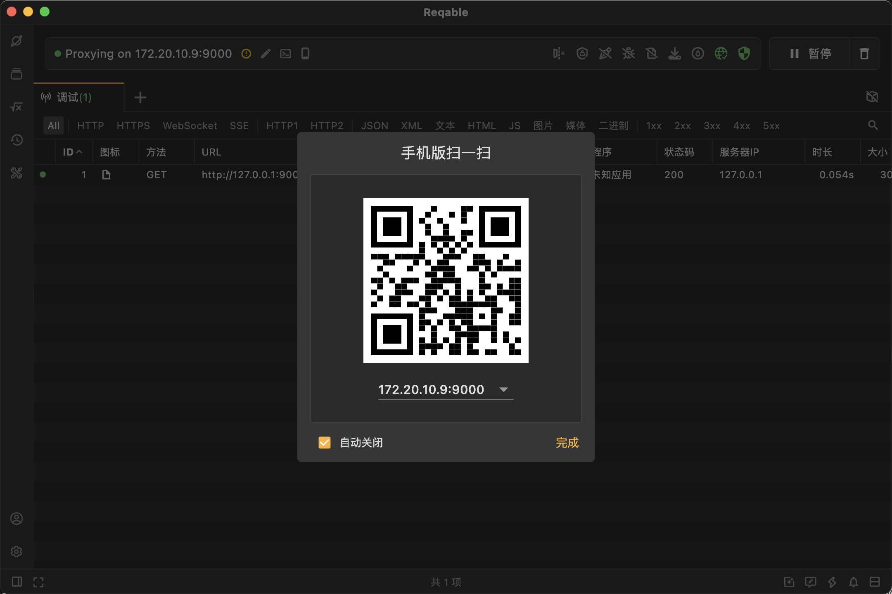

## 前言

最近我老婆要上班打卡，用了小程序，但是容易忘记，想着给她写个脚本吧。

## 抓包

现在抓包比以前强多了，各种方便的工具，原理其实很简单，就是在设备上起代理服务，然后安装特殊的root证书，用于解开https报文，所以说，有些网站让你信任不安全的证书，是真的不安全。会有中间人攻击的。

冲浪了一下，用了国产的[reqable](https://reqable.com/zh-CN/),免费版对于我抓抓包就够了。比charles明朗多了。

和ios搭配也很方便，直接扫码即可。手动安装下证书，然后去about里trust就好了。

当然有些小程序macos直接有电脑端，直接抓电脑的也行。



## 逆向

这年头光抓报文没用的，还得逆向代码，一般公司不去做特殊的混淆编译的话，还是很容易破解的。

这里用到的是 [wxappUnpacker](https://gitee.com/ksd/wxappUnpacker.git)

```shell
git clone https://gitee.com/ksd/wxappUnpacker.git

npm install
npm install esprima
npm install css-tree
npm install cssbeautify
npm install vm2
npm install uglify-es
npm install js-beautify
```
然后找到到macos的小程序cache目录，找到对应的根据id找到对应的小程序。执行编译命令.

macos下的目录都是wx+appId的目录，appId我是在抓包的报文里看到的。

```
cd ~/Library/Containers/com.tencent.xinWeChat/Data/.wxapplet/packages/
cd wx1234567890
./bingo.sh ../__APP__.wxapkg
```

逆向可能有报错，可以忽略。但是大概率是能拿得到文件的。
最后得到了一个__APP__文件目录

```
ls
__APP__        __APP__.wxapkg wxappUnpacker

ls -lah
total 5152
drwxr-xr-x   9 zero  staff   288B Apr 21 09:46 .
drwx------@  6 zero  staff   192B Apr 21 09:47 ..
-rw-r--r--   1 zero  staff    22K Apr 21 09:46 app-config.json
-rw-r--r--   1 zero  staff   1.5M Apr 21 09:46 app-service.js
drwxr-xr-x  23 zero  staff   736B Apr 21 09:46 components
-rw-r--r--   1 zero  staff   1.0M Apr 21 09:46 page-frame.html
drwxr-xr-x  25 zero  staff   800B Apr 21 09:46 pages
drwxr-xr-x  17 zero  staff   544B Apr 21 09:46 static
drwxr-xr-x  14 zero  staff   448B Apr 21 09:46 uni_modules

```

然后就很简单了，ai一顿分析，我直接用antigravity分析，就得到了核心的几个api接口。包括怎么调用，前后逻辑。
换作以前，眼都得看花了，ai时代，效率提升太大了。
